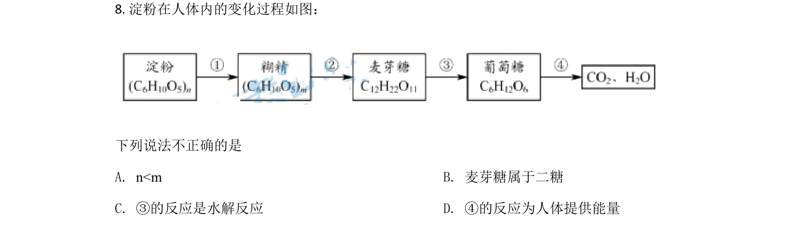
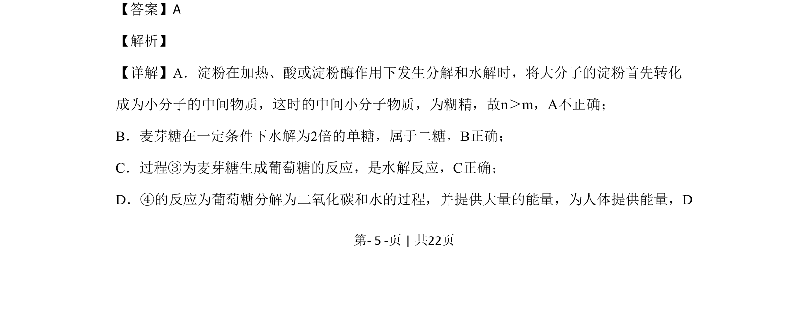
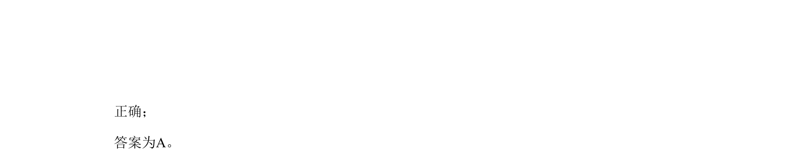

## 题面

## 摘要

该题考查淀粉水解、麦芽糖和葡萄糖性质，要求判断相关说法是否正确。

## 关联考点

- [[793-淀粉水解|淀粉水解]]
- [[520-麦芽糖|麦芽糖]]
- [[516-葡萄糖|葡萄糖]]
- [[糖类性质]]

## 答案与解析

> 📄 原 PDF 第 5 页：`素材/真题/北京/2008-2024·（北京）化学高考真题/2020年高考化学试卷（北京）（解析卷）.pdf`
