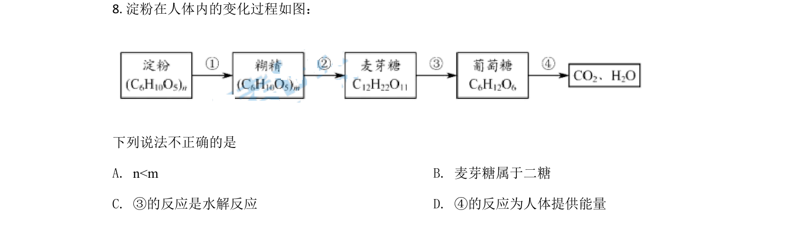
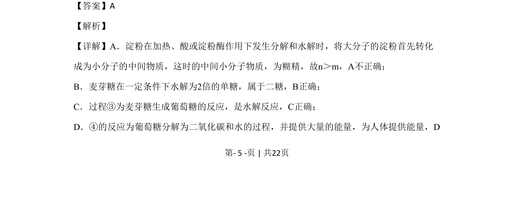
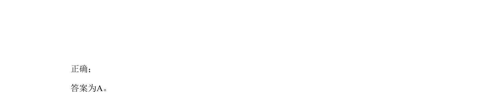

## 题面

## 摘要

该题考查淀粉水解、麦芽糖和葡萄糖性质，要求判断相关说法是否正确。

## 关联考点

- [[793-淀粉水解|淀粉水解]]
- [[520-麦芽糖|麦芽糖]]
- [[516-葡萄糖|葡萄糖]]
- [[糖类性质]]

## 答案与解析

> 📄 原 PDF 第 5 页：`素材/真题/北京/2008-2024·（北京）化学高考真题/2020年高考化学试卷（北京）（解析卷）.pdf`

<!-- 题干文本-start -->
## 题干文本
8. 淀粉在人体内的变化过程如图：
下列说法不正确的是
A. n<m B. 麦芽糖属于二糖
C. ③的反应是水解反应D. ④的反应为人体提供能量
<!-- 题干文本-end -->

<!-- 解析文本-start -->
## 解析文本
【答案】A
【解析】
【详解】A．淀粉在加热、酸或淀粉酶作用下发生分解和水解时，将大分子的淀粉首先转化
成为小分子的中间物质，这时的中间小分子物质，为糊精，故n＞m，A不正确；
B．麦芽糖在一定条件下水解为2倍的单糖，属于二糖，B正确；
C．过程③为麦芽糖生成葡萄糖的反应，是水解反应，C正确；
D．④的反应为葡萄糖分解为二氧化碳和水的过程，并提供大量的能量，为人体提供能量，D
<!-- 解析文本-end -->
