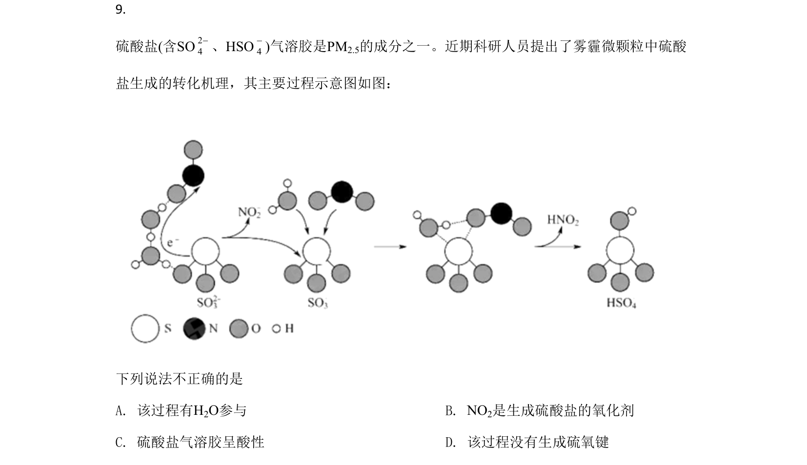
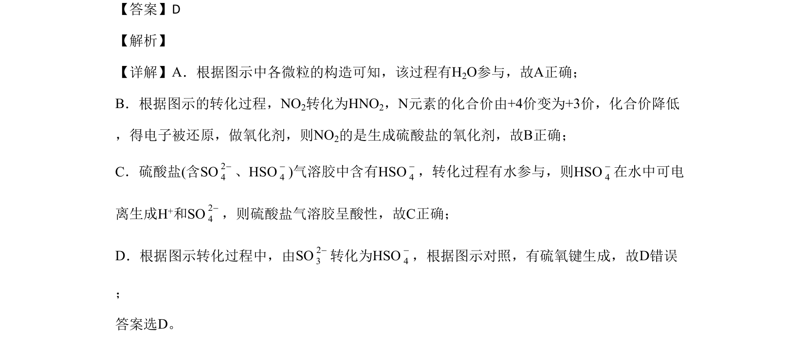

## 题面

## 摘要

本题考查NO₂转化生成HNO₂和硫酸盐的机理，分析元素化合价变化、氧化剂判断及微粒性质。

## 关联考点

- [[氮氧化物转化]]
- [[162-氧化还原反应|氧化还原反应]]
- [[166-电离|电解质电离]]
- [[258-化学键|化学键]]

## 答案与解析

> 📄 原 PDF 第 6 页：`素材/真题/北京/2008-2024·（北京）化学高考真题/2020年高考化学试卷（北京）（解析卷）.pdf`
