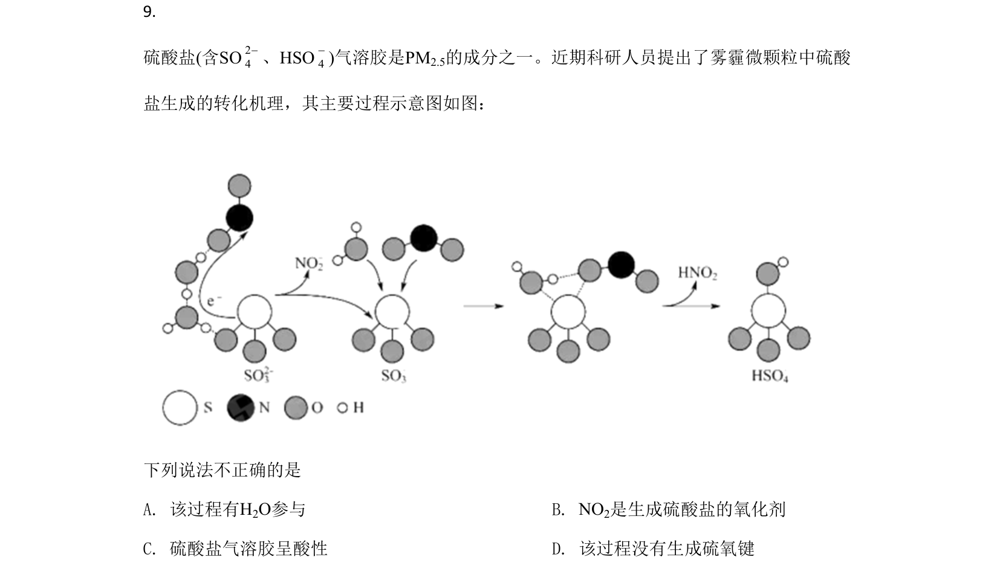
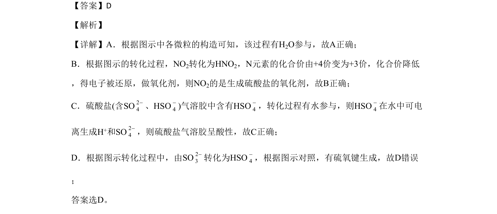

## 题面

## 摘要

本题考查NO₂转化生成HNO₂和硫酸盐的机理，分析元素化合价变化、氧化剂判断及微粒性质。

## 关联考点

- [[氮氧化物转化]]
- [[162-氧化还原反应|氧化还原反应]]
- [[166-电离|电解质电离]]
- [[258-化学键|化学键]]

## 答案与解析

> 📄 原 PDF 第 6 页：`素材/真题/北京/2008-2024·（北京）化学高考真题/2020年高考化学试卷（北京）（解析卷）.pdf`

<!-- 题干文本-start -->
## 题干文本
9. 
硫酸盐(含SO24-、HSO4-)气溶胶是PM2.5的成分之一。近期科研人员提出了雾霾微颗粒中硫酸
盐生成的转化机理，其主要过程示意图如图：
下列说法不正确的是
A. 该过程有H2O参与B. NO2是生成硫酸盐的氧化剂
C. 硫酸盐气溶胶呈酸性D. 该过程没有生成硫氧键
<!-- 题干文本-end -->

<!-- 解析文本-start -->
## 解析文本
【答案】D
【解析】
【详解】A．根据图示中各微粒的构造可知，该过程有H2O参与，故A正确；
B．根据图示的转化过程，NO2转化为HNO2，N元素的化合价由+4价变为+3价，化合价降低
，得电子被还原，做氧化剂，则NO2的是生成硫酸盐的氧化剂，故B正确；
C．硫酸盐(含SO24-、HSO4-)气溶胶中含有HSO4-，转化过程有水参与，则HSO4-在水中可电
离生成H+和SO24-，则硫酸盐气溶胶呈酸性，故C正确；
D．根据图示转化过程中，由SO23-转化为HSO4-，根据图示对照，有硫氧键生成，故D错误
；
答案选D。
<!-- 解析文本-end -->
