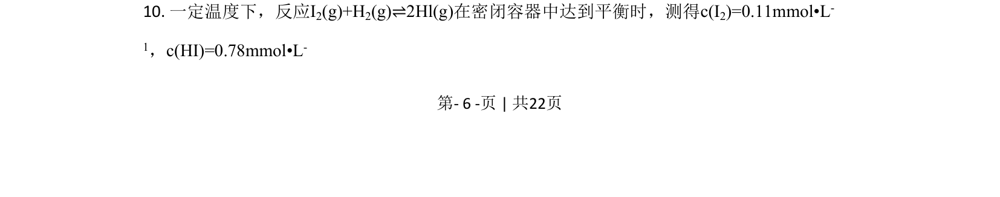
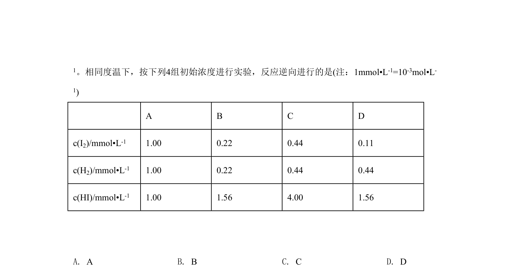
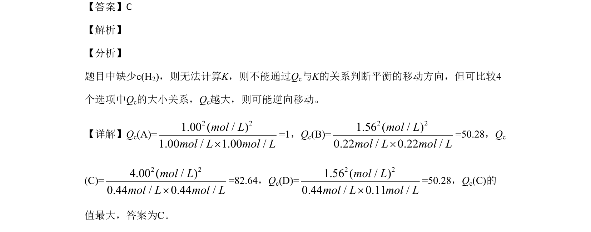

## 题面

## 摘要

通过计算浓度商Q比较化学平衡移动方向

## 关联考点

- [[284-化学平衡|化学平衡]]
- [[浓度商]]
- [[349-平衡移动|平衡移动]]

## 答案与解析

> 📄 原 PDF 第 6 页：`素材/真题/北京/2008-2024·（北京）化学高考真题/2020年高考化学试卷（北京）（解析卷）.pdf`

<!-- 题干文本-start -->
## 题干文本
10. 一定温度下，反应I2(g)+H2(g)⇌2Hl(g)在密闭容器中达到平衡时，测得c(I2)=0.11mmol•L-
1，c(HI)=0.78mmol•L-
<!-- 题干文本-end -->

<!-- 解析文本-start -->
## 解析文本

<!-- 解析文本-end -->
