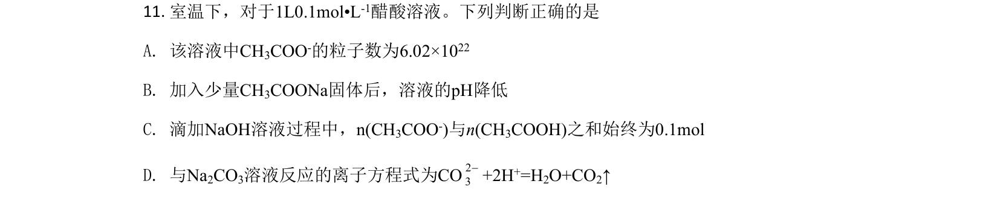
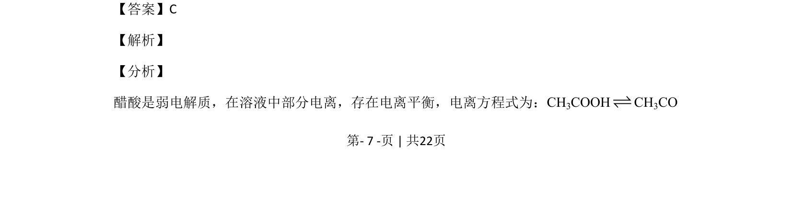
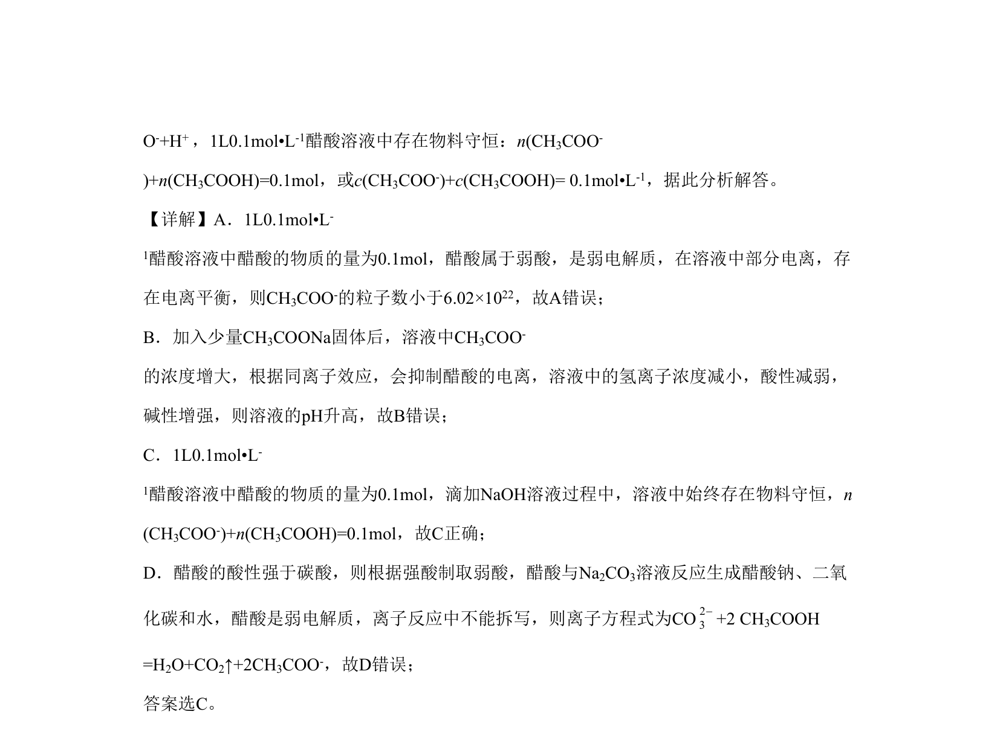

## 题面

## 摘要

考查醋酸弱电解质的电离平衡、物料守恒、同离子效应及离子方程式正误判断。

## 关联考点

- [[928-弱电解质的电离平衡|弱电解质的电离平衡]]
- [[772-物料守恒|物料守恒]]
- [[同离子效应]]
- [[806-离子方程式书写|离子方程式书写]]

## 答案与解析

> 📄 原 PDF 第 7 页：`素材/真题/北京/2008-2024·（北京）化学高考真题/2020年高考化学试卷（北京）（解析卷）.pdf`
