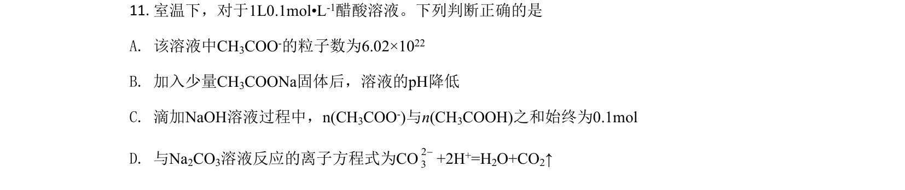
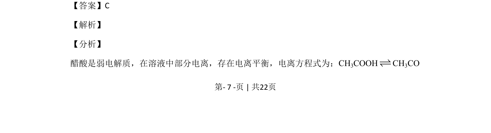
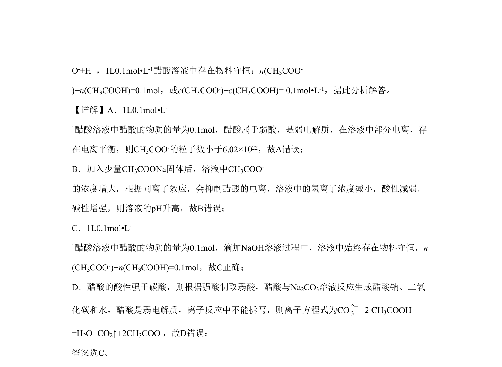

## 题面

## 摘要

考查醋酸弱电解质的电离平衡、物料守恒、同离子效应及离子方程式正误判断。

## 关联考点

- [[928-弱电解质的电离平衡|弱电解质的电离平衡]]
- [[772-物料守恒|物料守恒]]
- [[同离子效应]]
- [[807-离子方程式的书写|离子方程式书写]]

## 答案与解析

> 📄 原 PDF 第 7 页：`素材/真题/北京/2008-2024·（北京）化学高考真题/2020年高考化学试卷（北京）（解析卷）.pdf`

<!-- 题干文本-start -->
## 题干文本
11. 室温下，对于1L0.1mol•L-1醋酸溶液。下列判断正确的是
A. 该溶液中CH3COO-的粒子数为6.02×1022
B. 加入少量CH3COONa固体后，溶液的pH降低
C. 滴加NaOH溶液过程中，n(CH3COO-)与n(CH3COOH)之和始终为0.1mol
D. 与Na2CO3溶液反应的离子方程式为CO23-+2H+=H2O+CO2↑
<!-- 题干文本-end -->

<!-- 解析文本-start -->
## 解析文本
【答案】C
【解析】
【分析】
醋酸是弱电解质，在溶液中部分电离，存在电离平衡，电离方程式为：CH3COOHCH3CO
<!-- 解析文本-end -->
