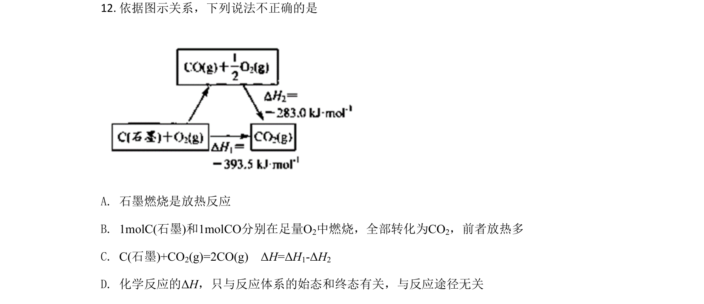
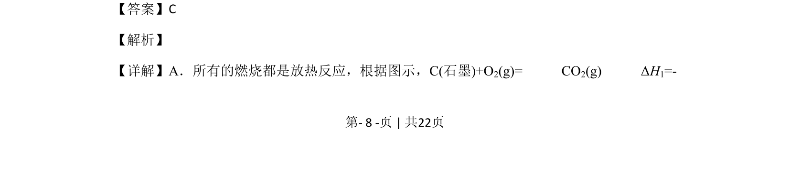
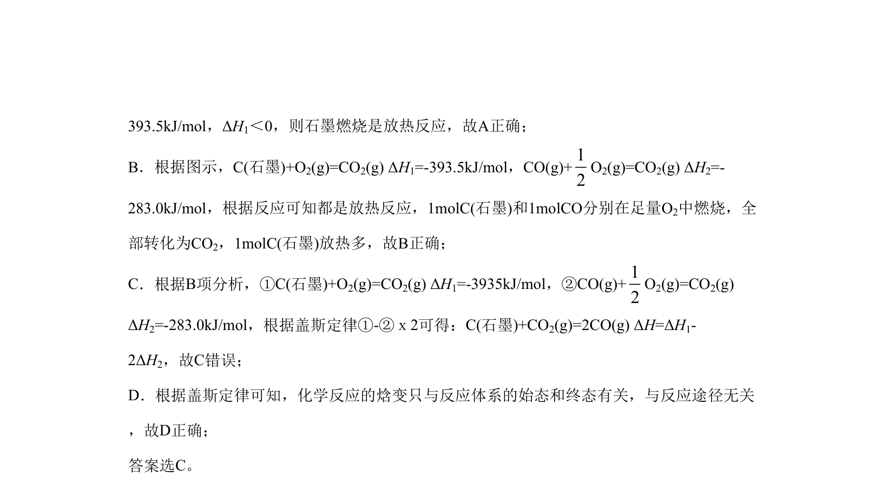

## 题面

## 摘要

考查热化学方程式、燃烧热与盖斯定律，利用焓变计算判断说法正误

## 关联考点

- [[309-热化学方程式|热化学方程式]]
- [[155-燃料热值|燃烧热]]
- [[311-盖斯定律|盖斯定律]]
- [[873-反应热计算|焓变计算]]

## 答案与解析

> 📄 原 PDF 第 8 页：`素材/真题/北京/2008-2024·（北京）化学高考真题/2020年高考化学试卷（北京）（解析卷）.pdf`
