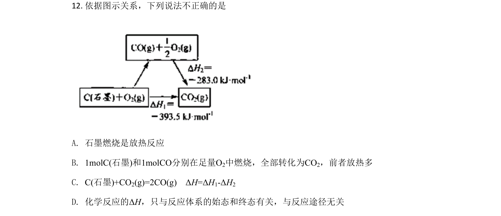
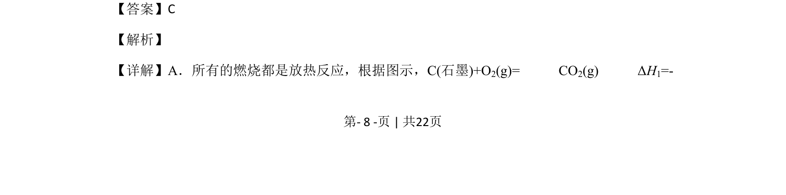
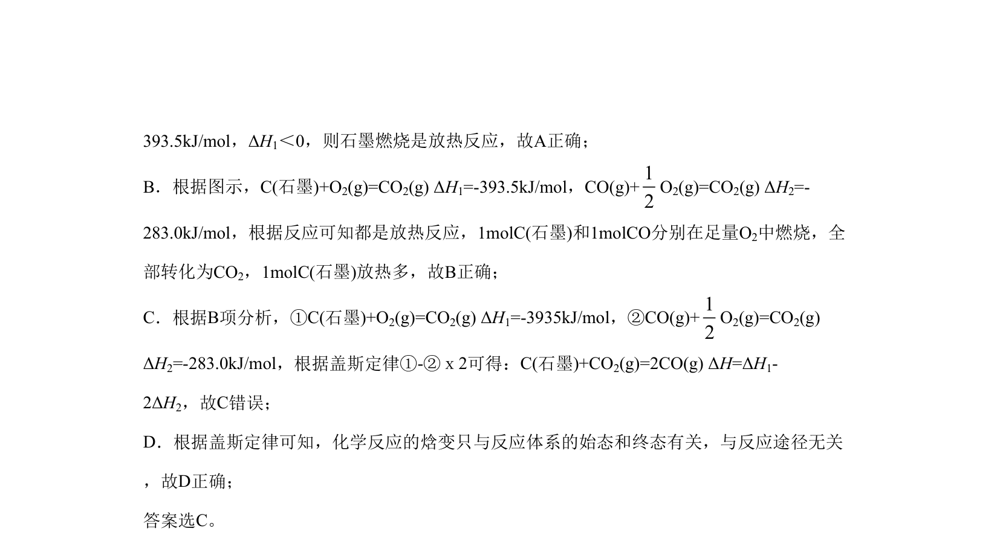

## 题面

## 摘要

考查热化学方程式、燃烧热与盖斯定律，利用焓变计算判断说法正误

## 关联考点

- [[309-热化学方程式|热化学方程式]]
- [[155-燃料热值|燃烧热]]
- [[311-盖斯定律|盖斯定律]]
- [[873-反应热计算|焓变计算]]

## 答案与解析

> 📄 原 PDF 第 8 页：`素材/真题/北京/2008-2024·（北京）化学高考真题/2020年高考化学试卷（北京）（解析卷）.pdf`

<!-- 题干文本-start -->
## 题干文本
12. 依据图示关系，下列说法不正确的是
A. 石墨燃烧是放热反应
B. 1molC(石墨)和1molCO分别在足量O2中燃烧，全部转化为CO2，前者放热多
C. C(石墨)+CO2(g)=2CO(g)    ΔH=ΔH1-ΔH2
D. 化学反应的ΔH，只与反应体系的始态和终态有关，与反应途径无关
<!-- 题干文本-end -->

<!-- 解析文本-start -->
## 解析文本
【答案】C
【解析】
【详解】A．所有的燃烧都是放热反应，根据图示，C(石墨)+O2(g)= CO 2(g) ΔH 1=-
<!-- 解析文本-end -->
