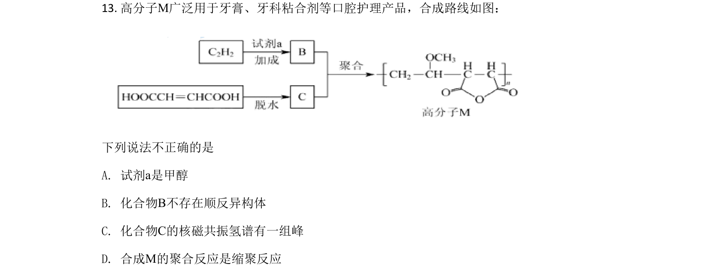
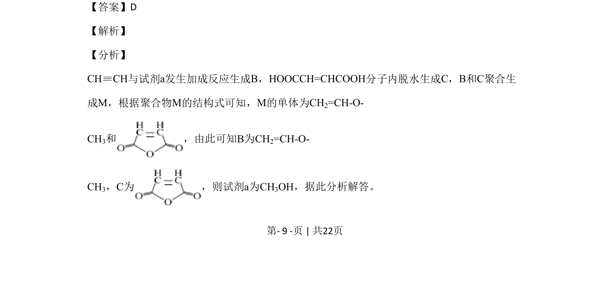
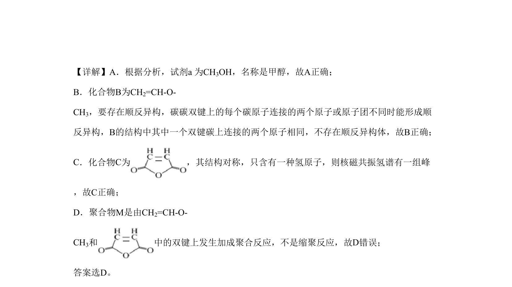

## 题面

## 摘要

本题考查有机物合成路线推断及聚合物合成，以及NH₄Cl受热分解实验分析。

## 关联考点

- [[233-乙烯加成反应|加成反应]]
- [[455-顺反异构|顺反异构]]
- [[723-核磁共振氢谱|核磁共振氢谱]]
- [[824-聚合反应|聚合反应]]
- [[742-水解反应|水解反应]]
- [[气体扩散]]

## 答案与解析

> 📄 原 PDF 第 9 页：`素材/真题/北京/2008-2024·（北京）化学高考真题/2020年高考化学试卷（北京）（解析卷）.pdf`
