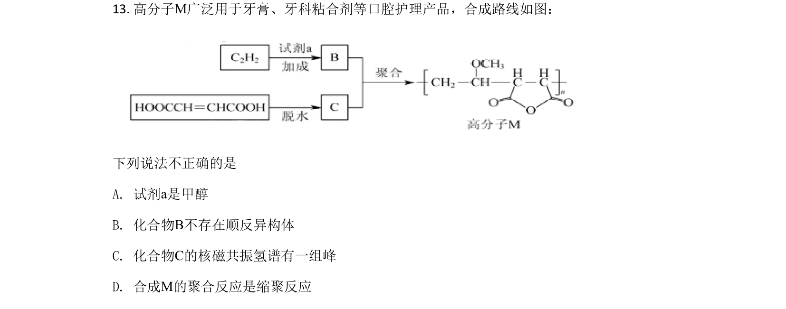
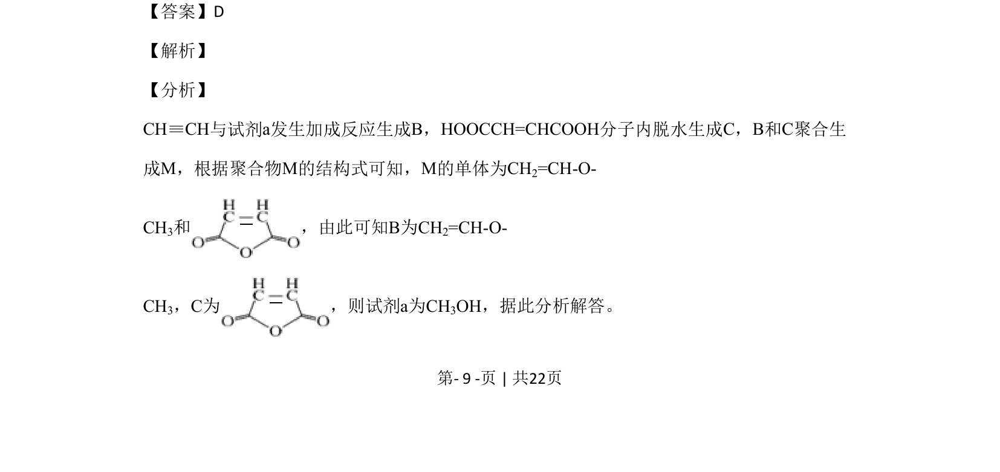
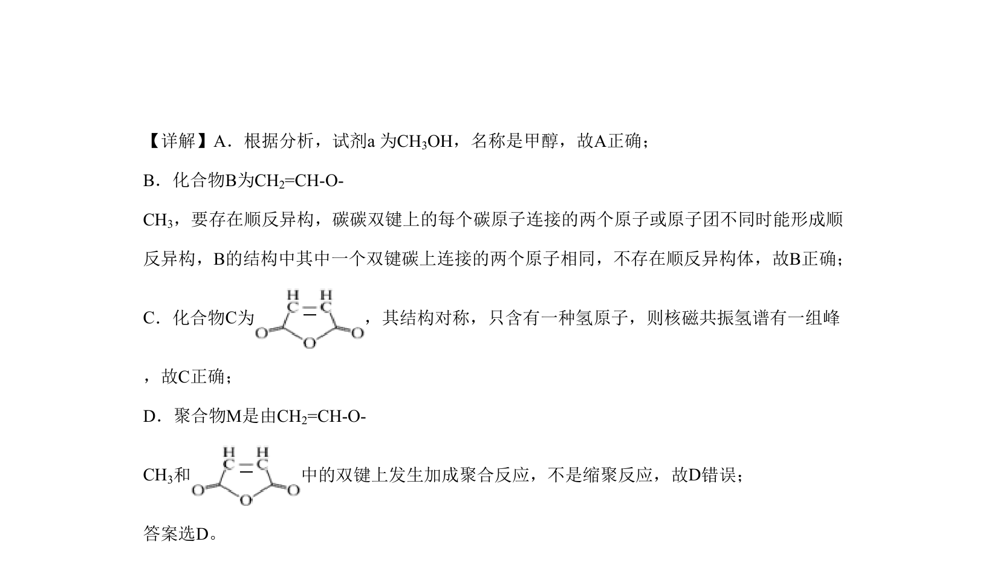

## 题面

## 摘要

本题考查有机物合成路线推断及聚合物合成，以及NH₄Cl受热分解实验分析。

## 关联考点

- [[233-乙烯加成反应|加成反应]]
- [[455-顺反异构|顺反异构]]
- [[723-核磁共振氢谱|核磁共振氢谱]]
- [[824-聚合反应|聚合反应]]
- [[742-水解反应|水解反应]]
- [[气体扩散]]

## 答案与解析

> 📄 原 PDF 第 9 页：`素材/真题/北京/2008-2024·（北京）化学高考真题/2020年高考化学试卷（北京）（解析卷）.pdf`

<!-- 题干文本-start -->
## 题干文本
13. 高分子M广泛用于牙膏、牙科粘合剂等口腔护理产品，合成路线如图：
下列说法不正确的是
A. 试剂a是甲醇
B. 化合物B不存在顺反异构体
C. 化合物C的核磁共振氢谱有一组峰
D. 合成M的聚合反应是缩聚反应
<!-- 题干文本-end -->

<!-- 解析文本-start -->
## 解析文本
【答案】D
【解析】
【分析】
CH≡CH与试剂a发生加成反应生成B，HOOCCH=CHCOOH分子内脱水生成C，B和C聚合生
成M，根据聚合物M的结构式可知，M的单体为CH2=CH-O-
CH3和 ，由此可知 B为CH2=CH-O-
CH3，C为 ，则试剂 a为CH3OH，据此分析解答。
<!-- 解析文本-end -->
