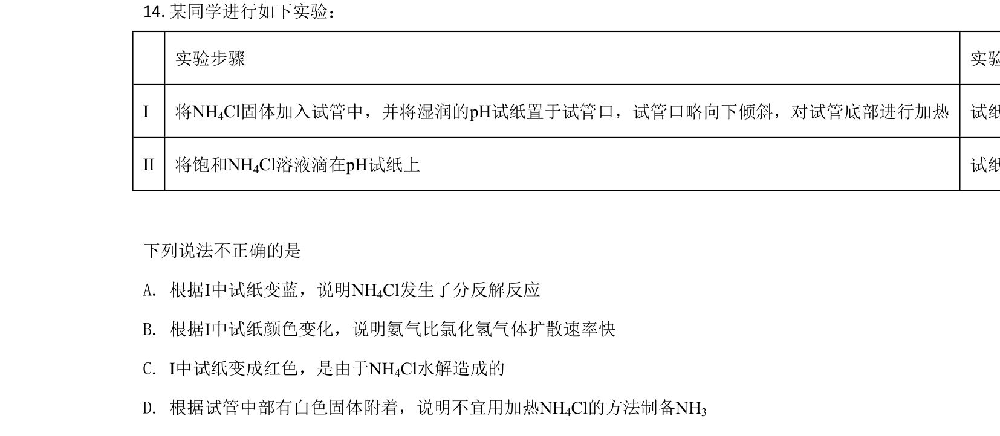
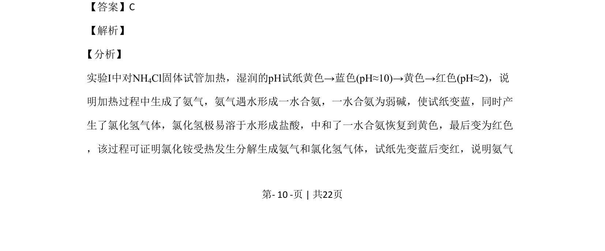
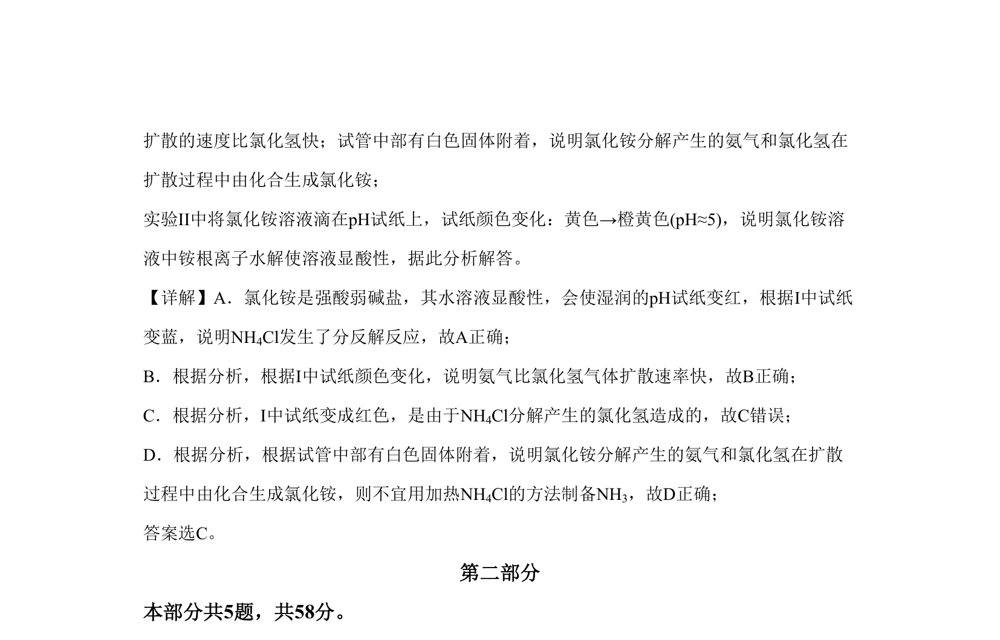

## 题面

## 摘要

通过pH试纸颜色变化探究氯化铵受热分解与水解显酸性

## 关联考点

- [[铵盐分解]]
- [[336-盐类水解|盐类水解]]
- [[气体扩散速率]]
- [[pH试纸]]

## 答案与解析

> 📄 原 PDF 第 10 页：`素材/真题/北京/2008-2024·（北京）化学高考真题/2020年高考化学试卷（北京）（解析卷）.pdf`

<!-- 题干文本-start -->
## 题干文本
14. 某同学进行如下实验：
实验步骤 实验现象
I 将NH4Cl固体加入试管中，并将湿润的pH试纸置于试管口，试管口略向下倾斜，对试管底部进行加热 试纸颜色变化：黄色→蓝色(pH≈10)→黄色→红色(pH≈2)；试管中部有白色固体附着
II 将饱和NH4Cl溶液滴在pH试纸上 试纸颜色变化：黄色→橙黄色(pH≈5)
下列说法不正确的是
A. 根据I中试纸变蓝，说明NH4Cl发生了分反解反应
B. 根据I中试纸颜色变化，说明氨气比氯化氢气体扩散速率快
C. I中试纸变成红色，是由于NH4Cl水解造成的
D. 根据试管中部有白色固体附着，说明不宜用加热NH4Cl的方法制备NH3
<!-- 题干文本-end -->

<!-- 解析文本-start -->
## 解析文本
【答案】C
【解析】
分析】
实验I中对NH4Cl固体试管加热，湿润的pH试纸黄色→蓝色(pH≈10)→黄色→红色(pH≈2)，说
明加热过程中生成了氨气，氨气遇水形成一水合氨，一水合氨为弱碱，使试纸变蓝，同时产
生了氯化氢气体，氯化氢极易溶于水形成盐酸，中和了一水合氨恢复到黄色，最后变为红色
，该过程可证明氯化铵受热发生分解生成氨气和氯化氢气体，试纸先变蓝后变红，说明氨气
【
<!-- 解析文本-end -->
