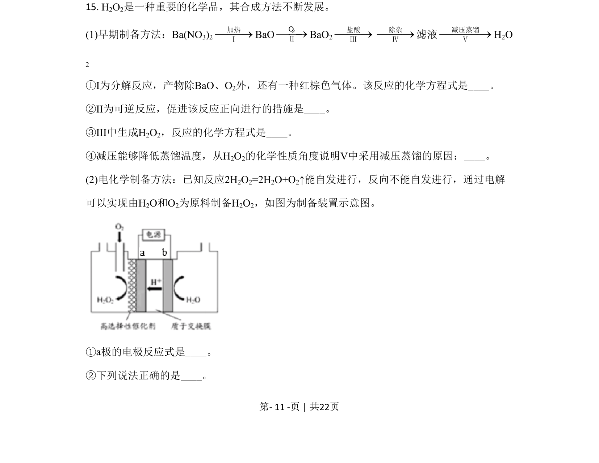
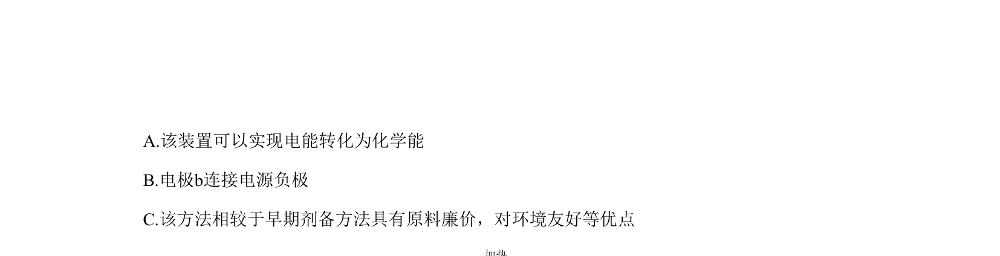
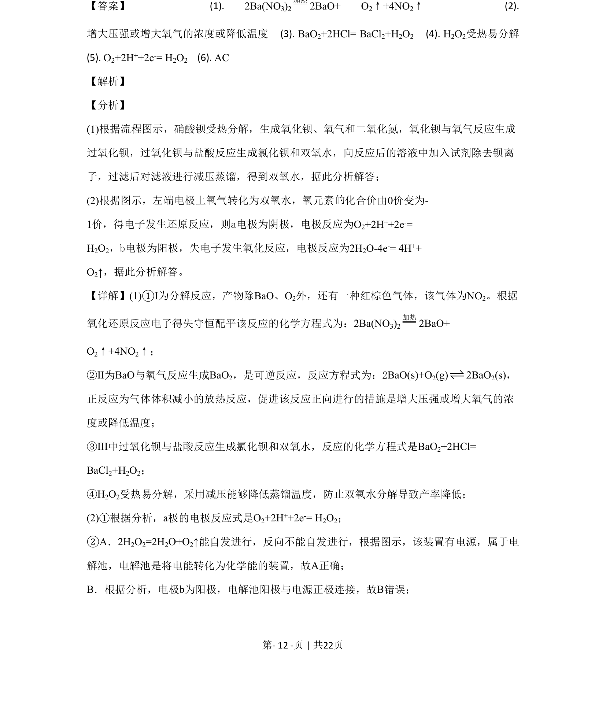
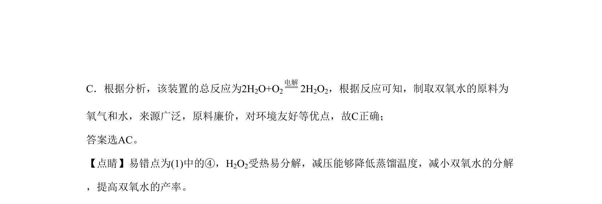

## 题面

## 摘要

化工流程制备双氧水，涉及热分解、可逆反应、电解原理及产物分离。

## 关联考点

- [[162-氧化还原反应|氧化还原反应]]
- [[054-方程式配平|化学方程式配平]]
- [[620-化学平衡移动|化学平衡移动]]
- [[981-电解池电极反应|电解池电极反应]]

## 答案与解析

> 📄 原 PDF 第 11 页：`素材/真题/北京/2008-2024·（北京）化学高考真题/2020年高考化学试卷（北京）（解析卷）.pdf`
