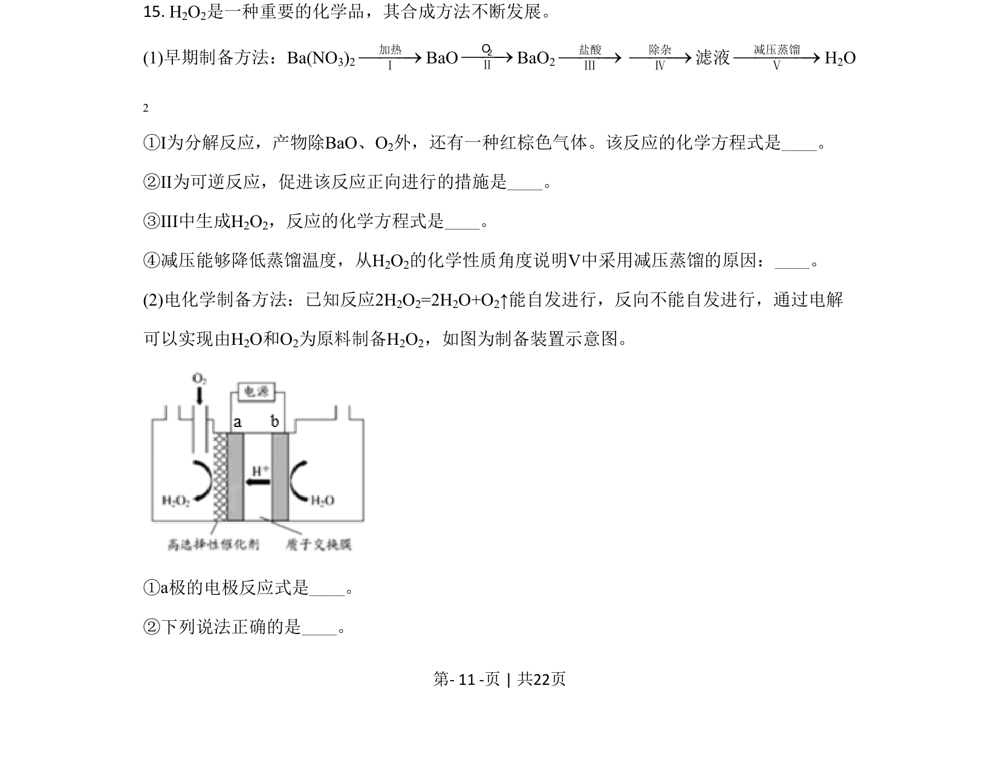
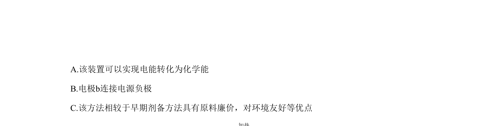
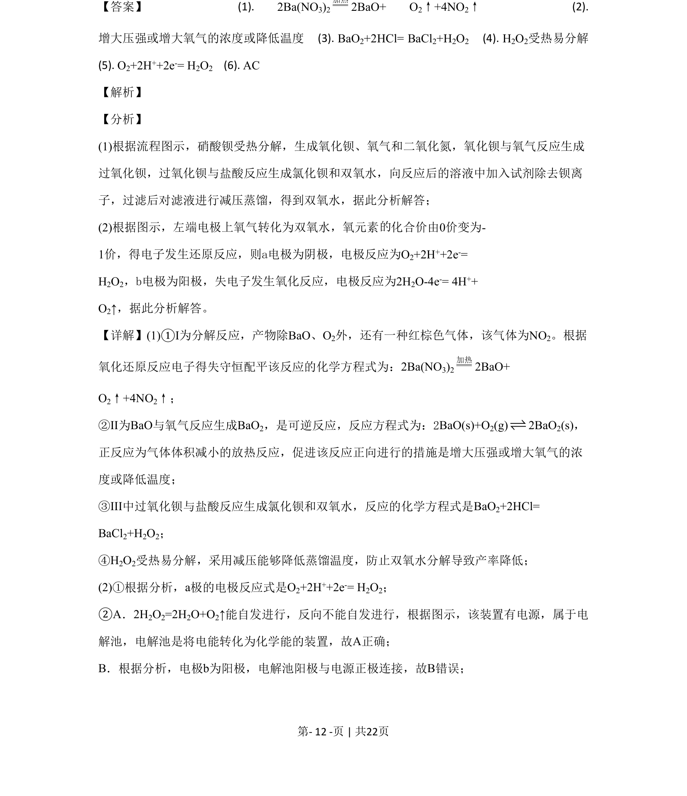
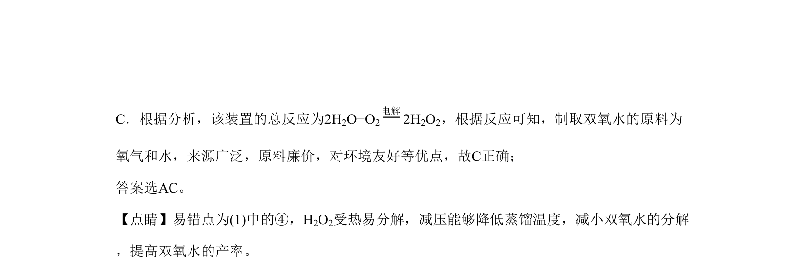

## 题面

## 摘要

化工流程制备双氧水，涉及热分解、可逆反应、电解原理及产物分离。

## 关联考点

- [[162-氧化还原反应|氧化还原反应]]
- [[054-方程式配平|化学方程式配平]]
- [[620-化学平衡移动|化学平衡移动]]
- [[981-电解池电极反应|电解池电极反应]]

## 答案与解析

> 📄 原 PDF 第 11 页：`素材/真题/北京/2008-2024·（北京）化学高考真题/2020年高考化学试卷（北京）（解析卷）.pdf`

<!-- 题干文本-start -->
## 题干文本
15. H2O2是一种重要的化学品，其合成方法不断发展。
(1)早期制备方法：Ba(NO3)2
加热Ⅰ¾¾¾ ®BaO2OⅡ¾¾ ®BaO2
盐酸Ⅲ¾¾¾ ®除杂Ⅳ¾¾ ¾ ®滤液减压蒸馏Ⅴ¾¾¾¾ ®H2O
2
①I为分解反应，产物除BaO、O2外，还有一种红棕色气体。该反应的化学方程式是____。
②II为可逆反应，促进该反应正向进行的措施是____。
③III中生成H2O2，反应的化学方程式是____。
④减压能够降低蒸馏温度，从H2O2的化学性质角度说明V中采用减压蒸馏的原因：____。
(2)电化学制备方法：已知反应2H2O2=2H2O+O2↑能自发进行，反向不能自发进行，通过电解
可以实现由H2O和O2为原料制备H2O2，如图为制备装置示意图。
①a极的电极反应式是____。
②下列说法正确的是____。
<!-- 题干文本-end -->

<!-- 解析文本-start -->
## 解析文本

<!-- 解析文本-end -->
