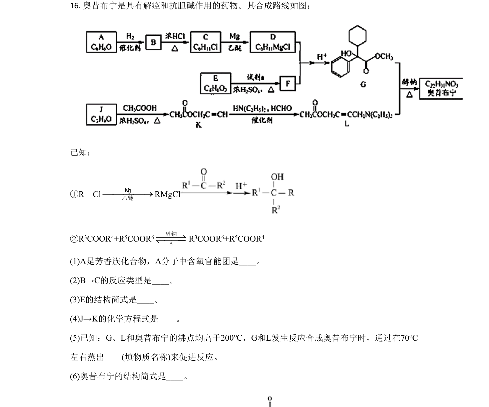
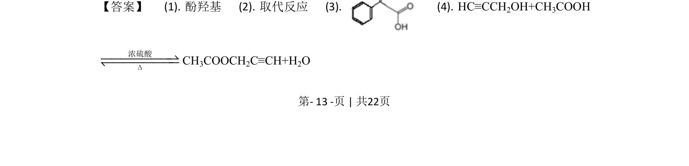
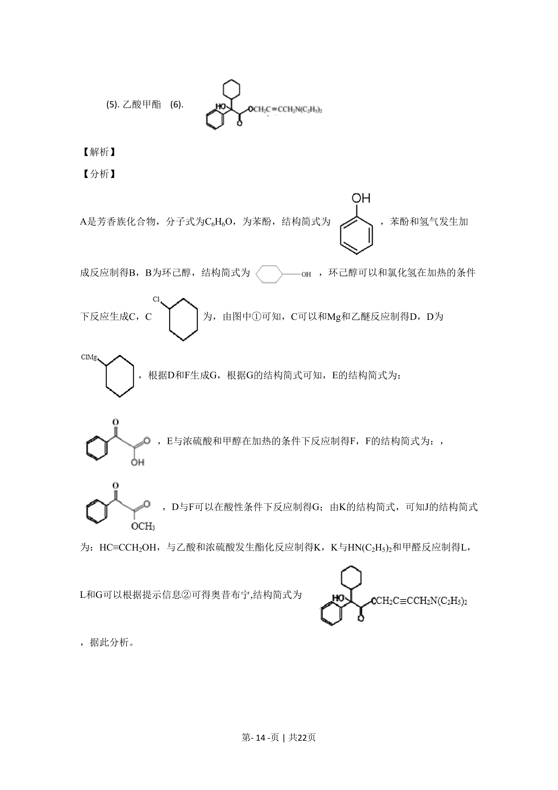
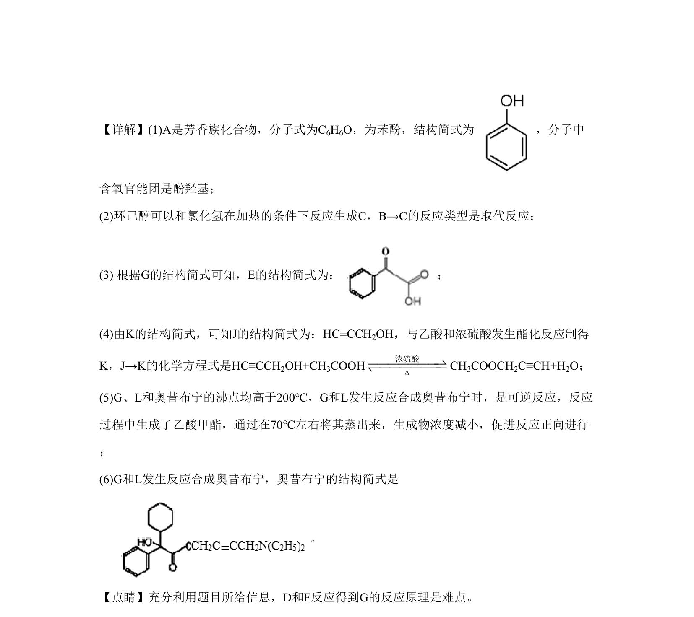

## 题面

## 摘要

考查有机合成推断（奥昔布宁）及废旧CPU中金属回收流程，涵盖官能团、反应类型、结构简式与方程式书写。

## 关联考点

- [[448-官能团|官能团]]
- [[651-取代反应|取代反应]]
- [[250-酯化反应|酯化反应]]
- [[289-可逆反应|可逆反应]]
- [[052-化学方程式|化学方程式]]

## 答案与解析

> 📄 原 PDF 第 13 页：`素材/真题/北京/2008-2024·（北京）化学高考真题/2020年高考化学试卷（北京）（解析卷）.pdf`
