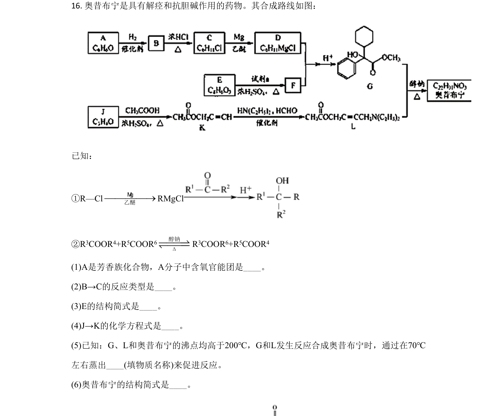
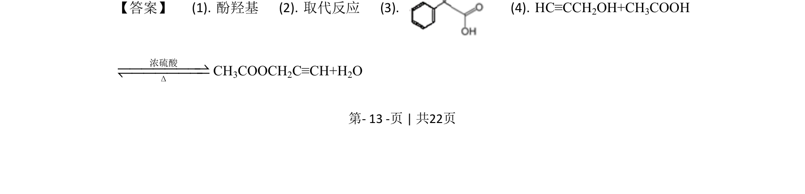
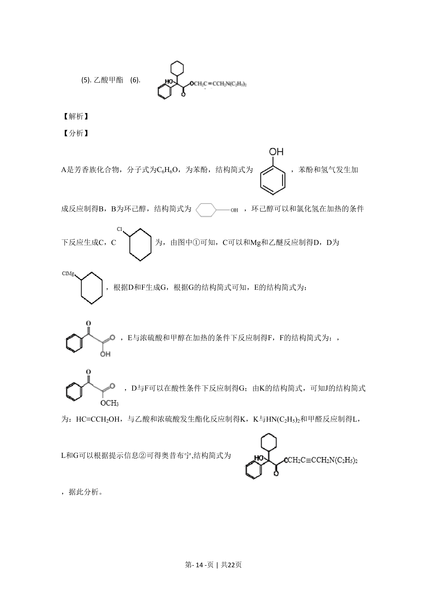
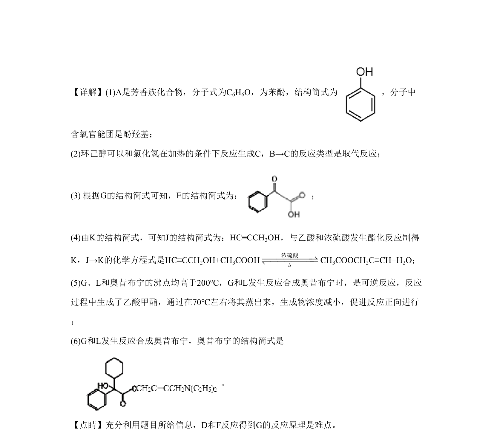

## 题面

## 摘要

考查有机合成推断（奥昔布宁）及废旧CPU中金属回收流程，涵盖官能团、反应类型、结构简式与方程式书写。

## 关联考点

- [[448-官能团|官能团]]
- [[651-取代反应|取代反应]]
- [[250-酯化反应|酯化反应]]
- [[289-可逆反应|可逆反应]]
- [[052-化学方程式|化学方程式]]

## 答案与解析

> 📄 原 PDF 第 13 页：`素材/真题/北京/2008-2024·（北京）化学高考真题/2020年高考化学试卷（北京）（解析卷）.pdf`

<!-- 题干文本-start -->
## 题干文本
16. 奥昔布宁是具有解痉和抗胆碱作用的药物。其合成路线如图：
已知：
①R—ClM g乙醚¾¾¾¾®RMgCl
②R3COOR4+R5COOR6醇钠Δˆˆˆ† ˆ‡ˆˆˆ ˆR3COOR6+R5COOR4
(1)A是芳香族化合物，A分子中含氧官能团是____。
(2)B→C的反应类型是____。
(3)E的结构简式是____。
(4)J→K的化学方程式是____。
(5)已知：G、L和奥昔布宁的沸点均高于200℃，G和L发生反应合成奥昔布宁时，通过在70℃
左右蒸出____(填物质名称)来促进反应。
(6)奥昔布宁的结构简式是____。
<!-- 题干文本-end -->

<!-- 解析文本-start -->
## 解析文本
【答案】    (1). 酚羟基    (2). 取代反应    (3).     (4). HC≡CCH2OH+CH3COOH
ˆˆˆˆˆˆˆ †‡ˆˆˆˆˆˆ ˆ浓硫酸ΔCH3COOCH2C≡CH+H2O
<!-- 解析文本-end -->
