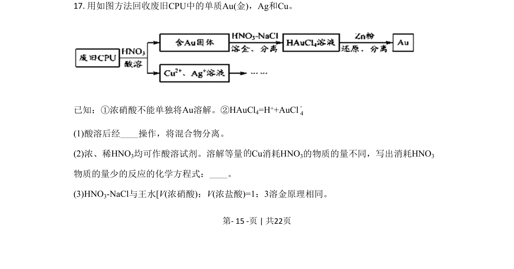
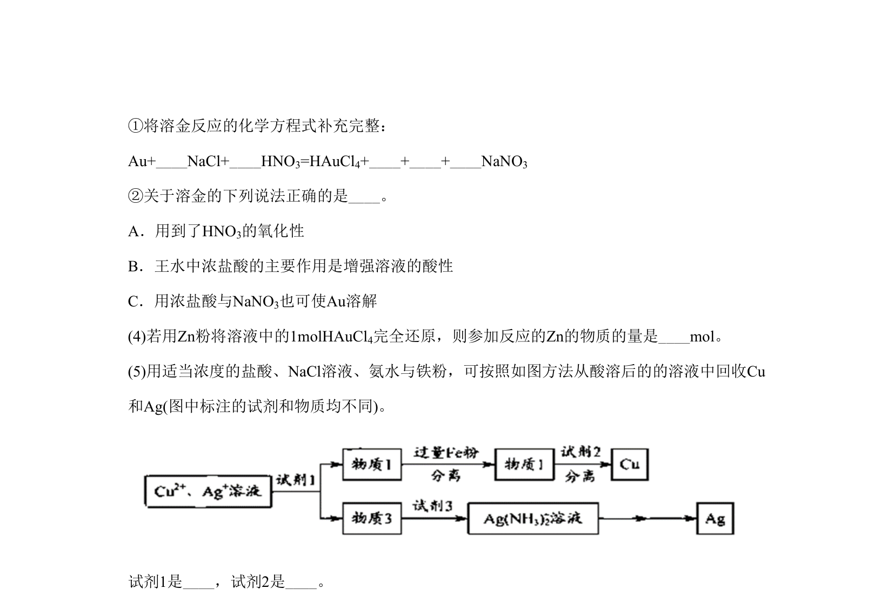
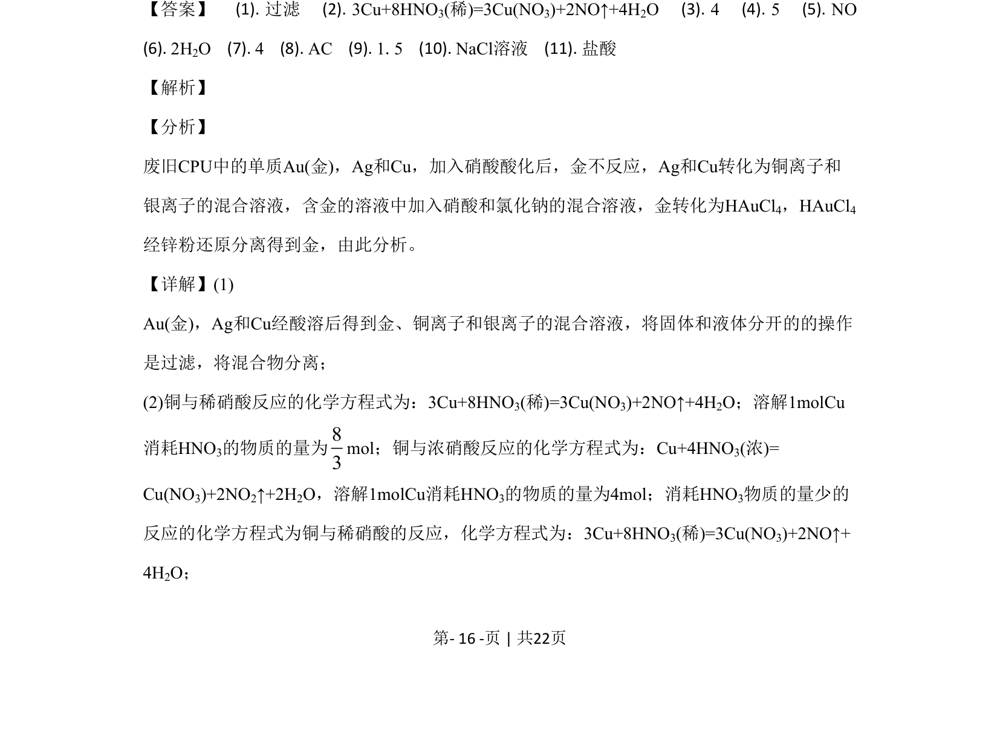
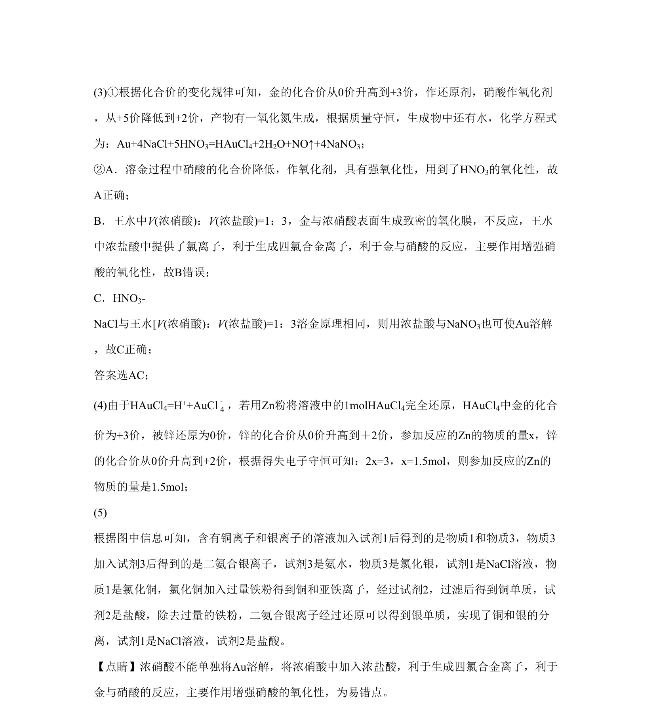

## 题面

## 摘要

该题以废旧CPU中金、银、铜的回收流程为情境，考查过滤操作、铜与稀硝酸和浓硝酸的反应方程式及计算、金溶解的氧化还原反应方程式的书写与判断。

## 关联考点

- [[080-过滤|过滤]]
- [[铜与硝酸反应]]
- [[氧化还原反应方程式]]
- [[氧化剂判断]]

## 答案与解析

> 📄 原 PDF 第 15 页：`素材/真题/北京/2008-2024·（北京）化学高考真题/2020年高考化学试卷（北京）（解析卷）.pdf`
