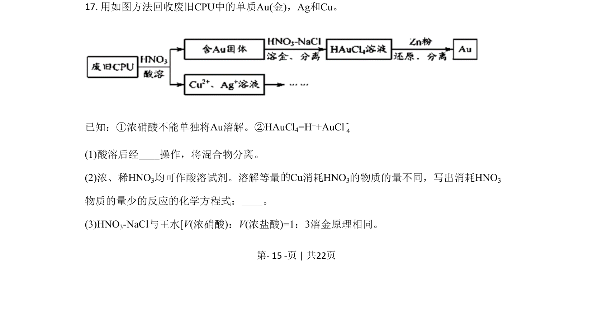
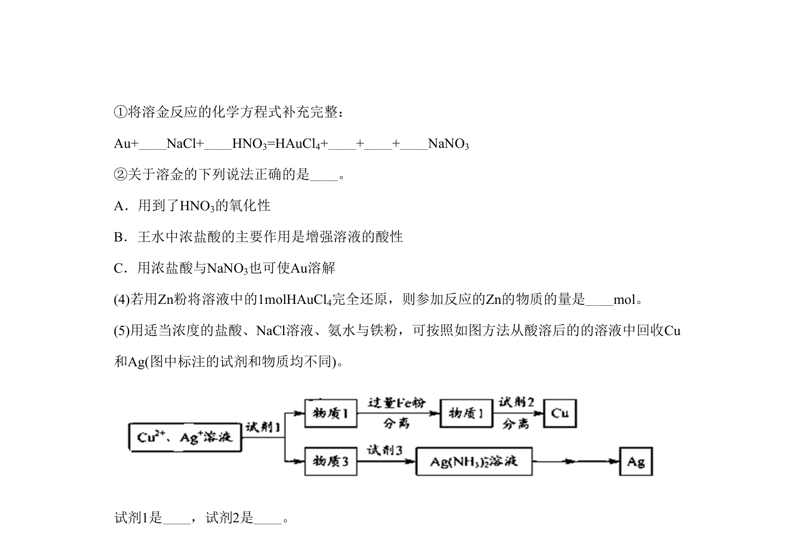
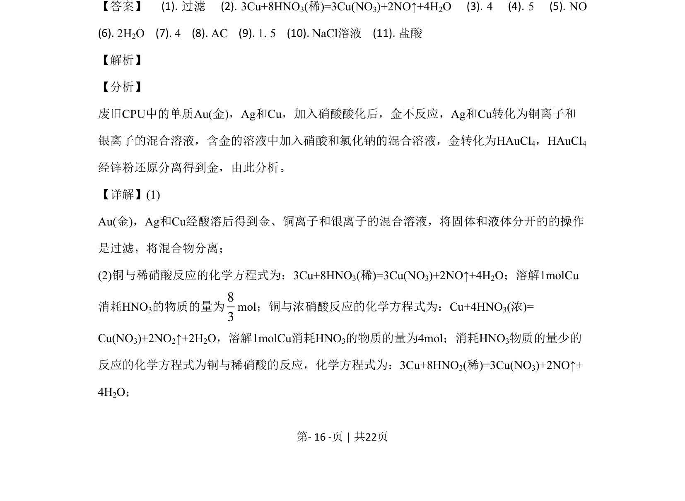
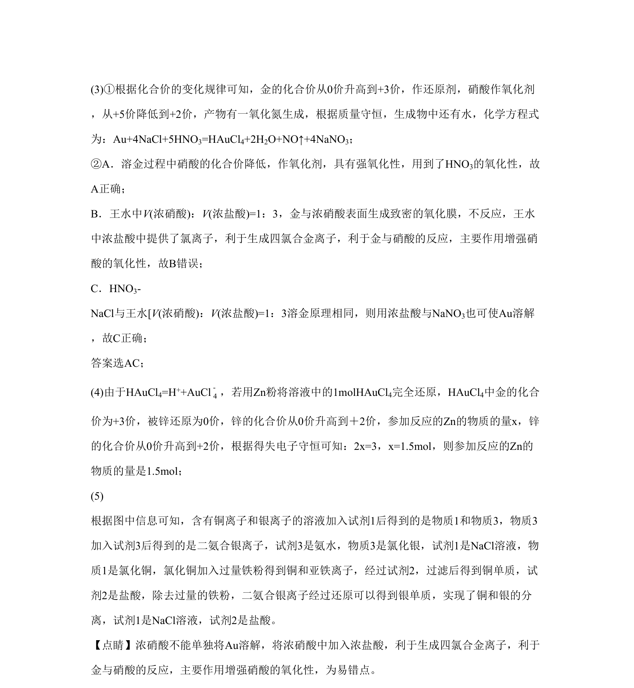

## 题面

## 摘要

该题以废旧CPU中金、银、铜的回收流程为情境，考查过滤操作、铜与稀硝酸和浓硝酸的反应方程式及计算、金溶解的氧化还原反应方程式的书写与判断。

## 关联考点

- [[080-过滤|过滤]]
- [[铜与硝酸反应]]
- [[氧化还原反应方程式]]
- [[氧化剂判断]]

## 答案与解析

> 📄 原 PDF 第 15 页：`素材/真题/北京/2008-2024·（北京）化学高考真题/2020年高考化学试卷（北京）（解析卷）.pdf`

<!-- 题干文本-start -->
## 题干文本
17. 用如图方法回收废旧CPU中的单质Au(金)，Ag和Cu。
已知：①浓硝酸不能单独将Au溶解。②HAuCl4=H++AuCl4-
(1)酸溶后经____操作，将混合物分离。
(2)浓、稀HNO3均可作酸溶试剂。溶解等量 Cu消耗HNO3的物质的量不同，写出消耗HNO3
物质的量少的反应的化学方程式：____。
(3)HNO3-NaCl与王水[V(浓硝酸)：V(浓盐酸)=1：3溶金原理相同。
的
<!-- 题干文本-end -->

<!-- 解析文本-start -->
## 解析文本

<!-- 解析文本-end -->
