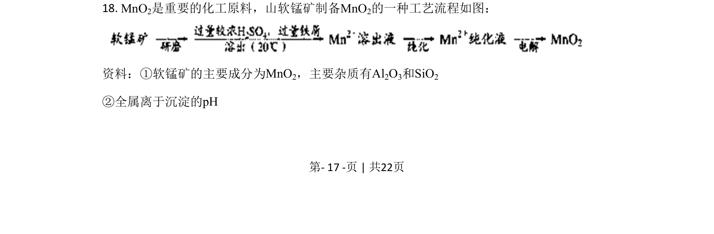
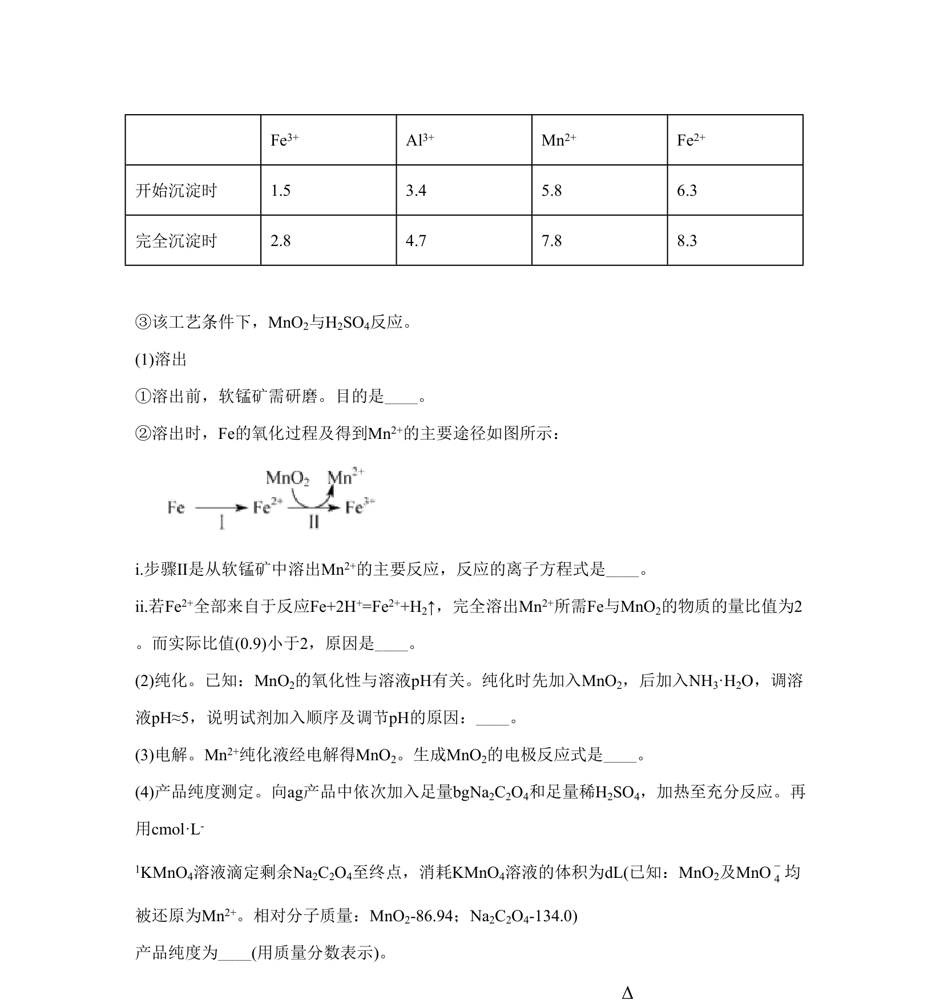
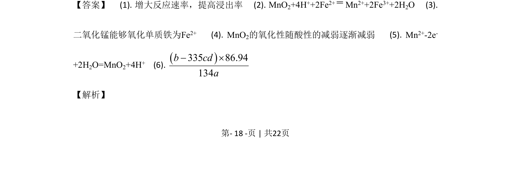
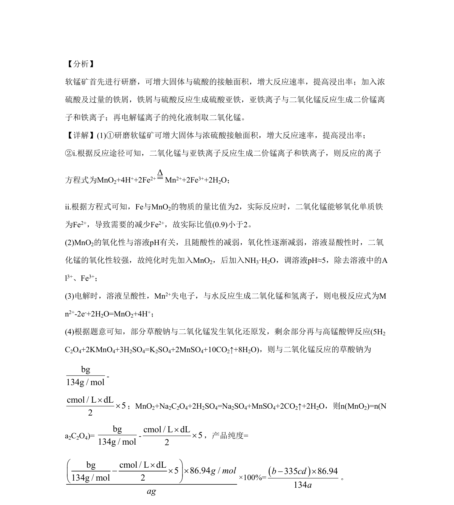

## 题面

## 摘要

考查软锰矿制备二氧化锰的工艺流程，涉及氧化还原反应、条件控制与含量测定。

## 关联考点

- [[162-氧化还原反应|氧化还原反应]]
- [[170-离子方程式|离子方程式]]
- [[367-电解原理|电解原理]]
- [[330-沉淀转化|沉淀转化]]

## 答案与解析

> 📄 原 PDF 第 17 页：`素材/真题/北京/2008-2024·（北京）化学高考真题/2020年高考化学试卷（北京）（解析卷）.pdf`
