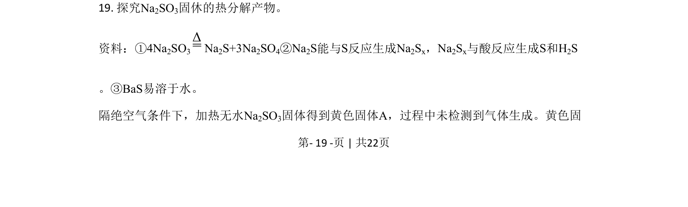
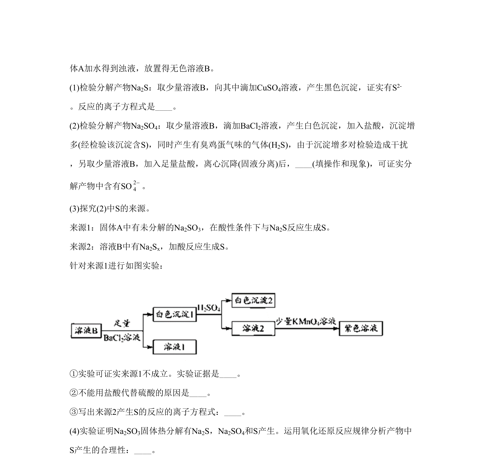
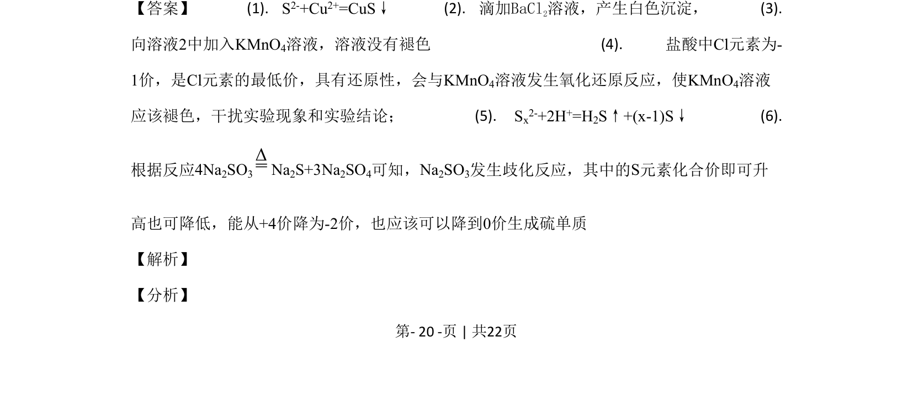
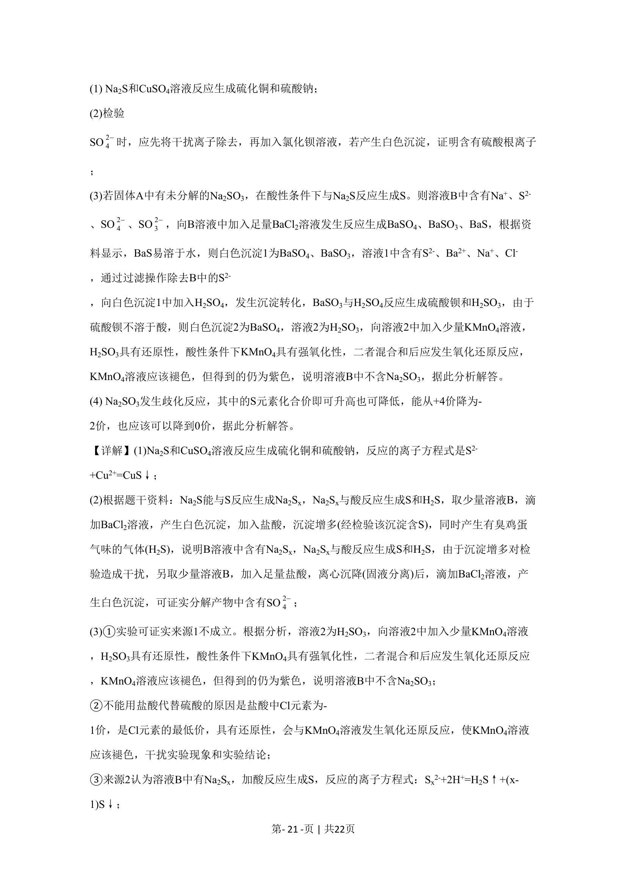
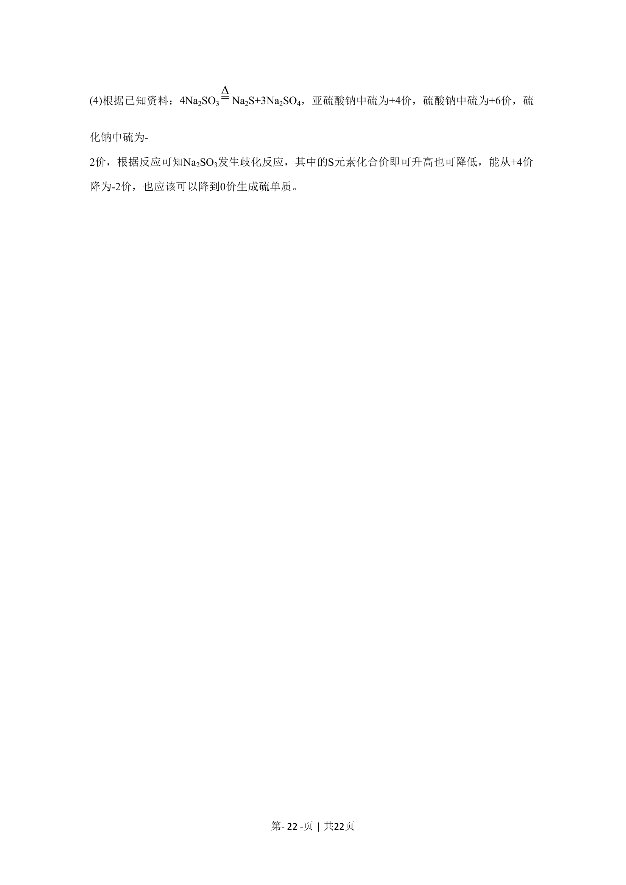

## 题面

## 摘要

检验硫酸根离子及沉淀转化，涉及离子检验、沉淀转化及过滤操作

## 关联考点

- [[检验硫酸根离子]]
- [[330-沉淀转化|沉淀转化]]
- [[沉淀的溶解与生成]]
- [[080-过滤|过滤操作]]

## 答案与解析

> 📄 原 PDF 第 19 页：`素材/真题/北京/2008-2024·（北京）化学高考真题/2020年高考化学试卷（北京）（解析卷）.pdf`
