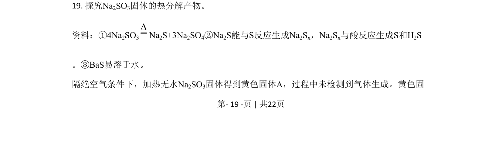
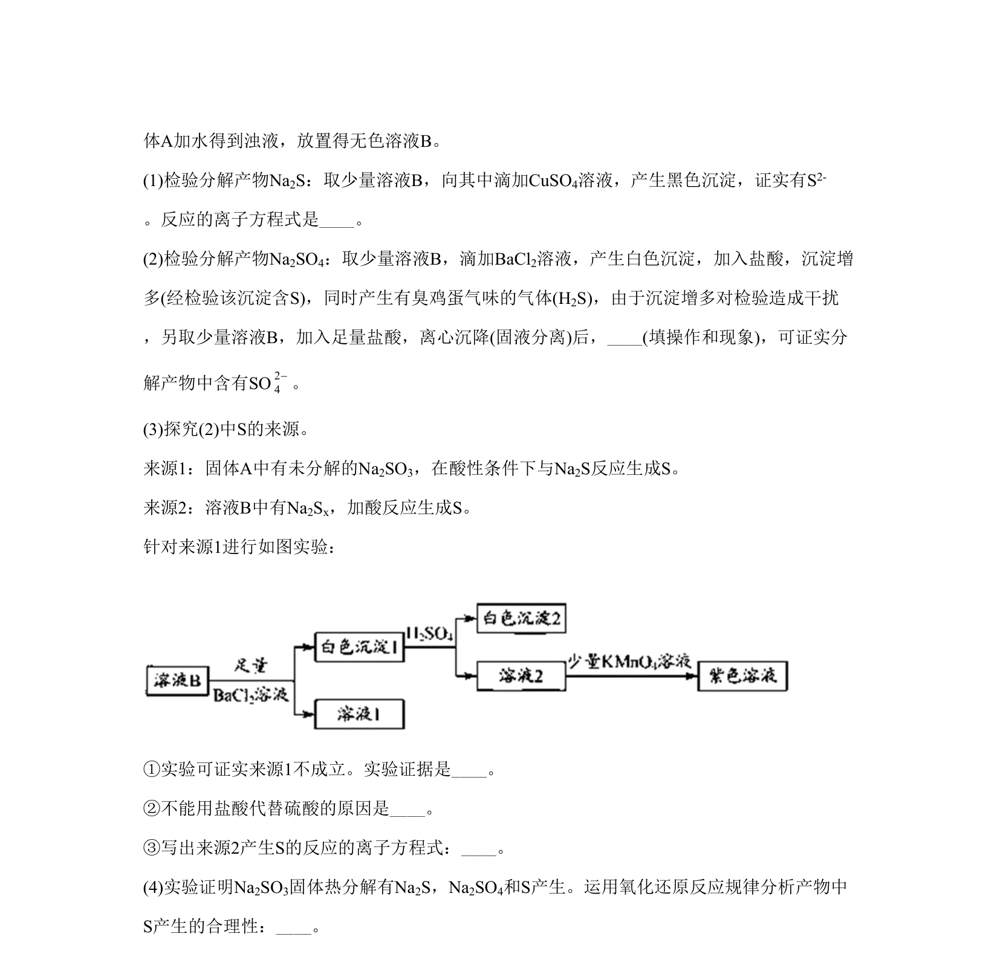
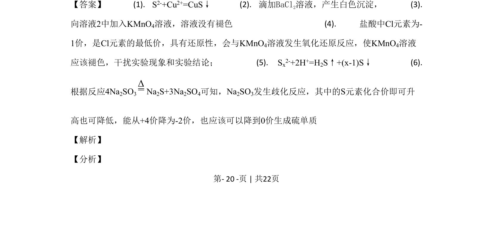
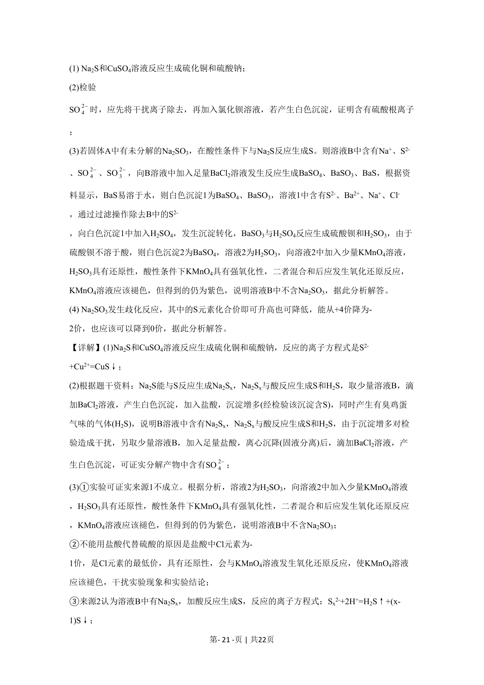
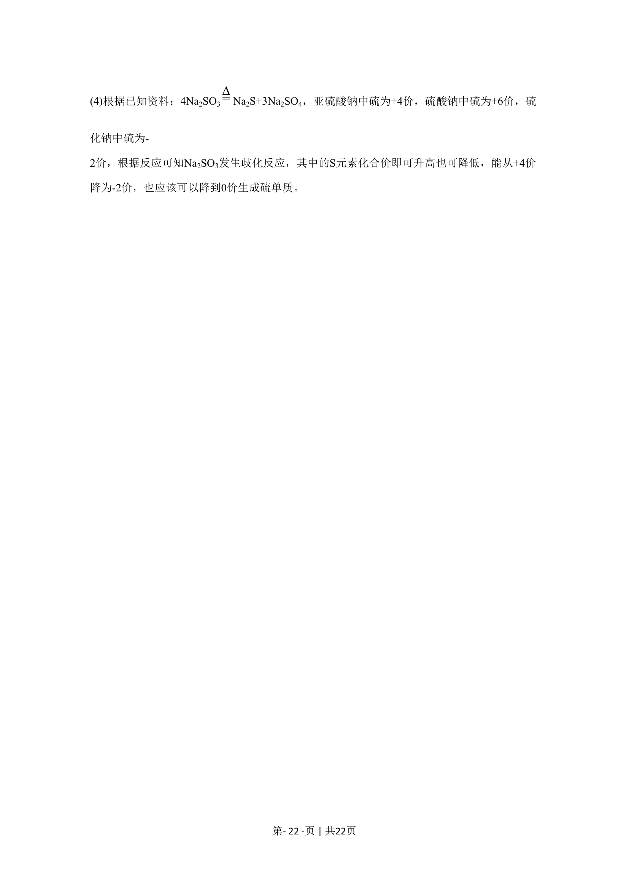

## 题面

## 摘要

检验硫酸根离子及沉淀转化，涉及离子检验、沉淀转化及过滤操作

## 关联考点

- [[检验硫酸根离子]]
- [[330-沉淀转化|沉淀转化]]
- [[沉淀的溶解与生成]]
- [[080-过滤|过滤操作]]

## 答案与解析

> 📄 原 PDF 第 19 页：`素材/真题/北京/2008-2024·（北京）化学高考真题/2020年高考化学试卷（北京）（解析卷）.pdf`

<!-- 题干文本-start -->
## 题干文本
19. 探究Na2SO3固休的热分解产物。
资料：①4Na2SO3
Δ
Na2S+3Na2SO4②Na2S能与S反应生成Na2Sx，Na2Sx与酸反应生成S和H2S
。③BaS易溶于水。
隔绝空气条件下，加热无水Na2SO3固体得到黄色固体A，过程中未检测到气体生成。黄色固
<!-- 题干文本-end -->

<!-- 解析文本-start -->
## 解析文本

<!-- 解析文本-end -->
