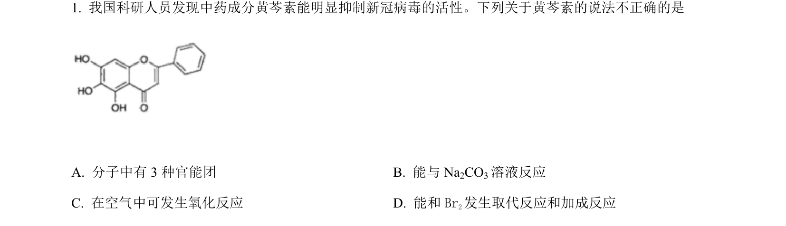
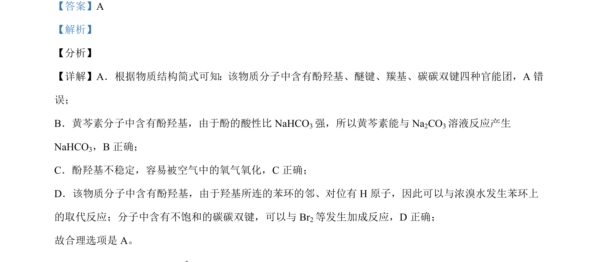

## 题面

## 摘要

考查黄芩素有机分子结构，判断官能团种类及其化学性质。

## 关联考点

- [[664-官能团识别|官能团识别]]
- [[酚的性质]]
- [[801-碳碳双键加成|碳碳双键加成]]
- [[苯环取代反应]]

## 答案与解析

> 📄 原 PDF 第 1 页：`素材/真题/北京/2008-2024·（北京）化学高考真题/2021年高考化学试卷（北京）（解析卷）.pdf`
