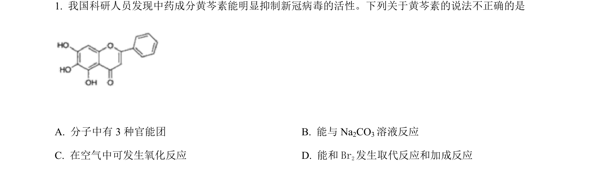
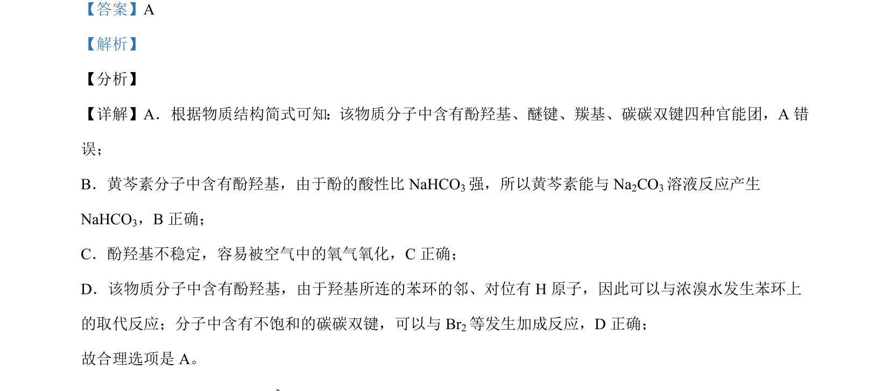

## 题面

## 摘要

考查黄芩素有机分子结构，判断官能团种类及其化学性质。

## 关联考点

- [[664-官能团识别|官能团识别]]
- [[酚的性质]]
- [[801-碳碳双键加成|碳碳双键加成]]
- [[苯环取代反应]]

## 答案与解析

> 📄 原 PDF 第 1 页：`素材/真题/北京/2008-2024·（北京）化学高考真题/2021年高考化学试卷（北京）（解析卷）.pdf`

<!-- 题干文本-start -->
## 题干文本
1. 我国科研人员发现中药成分黄芩素能明显抑制新冠病毒的活性。下列关于黄芩素的说法不正确的是
A. 分子中有 3 种官能团 B. 能与 Na2CO3溶液反应
C. 在空气中可发生氧化反应 D. 能和Br 2发生取代反应和加成反应
<!-- 题干文本-end -->

<!-- 解析文本-start -->
## 解析文本
【答案】A
【解析】
【分析】
【详解】A．根据物质结构简式可知：该物质分子中含有酚羟基、醚键、羰基、碳碳双键四种官能团，A 错
误；
B．黄芩素分子中含有酚羟基，由于酚的酸性比 NaHCO3强，所以黄芩素能与 Na2CO3溶液反应产生
NaHCO3，B正确；
C．酚羟基不稳定，容易被空气中的氧气氧化，C正确；
D．该物质分子中含有酚羟基，由于羟基所连的苯环的邻、对位有 H 原子，因此可以与浓溴水发生苯环上
的取代反应；分子中含有不饱和的碳碳双键，可以与 Br2等发生加成反应，D 正确；
故合理选项是 A。
<!-- 解析文本-end -->
