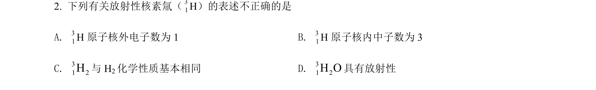
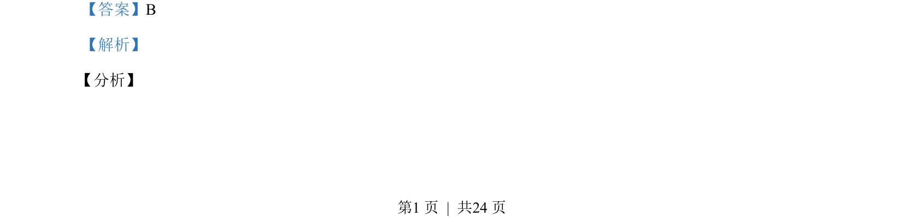
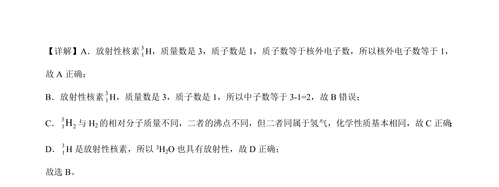

## 题面

## 摘要

该题考查原子结构中质量数、质子数、中子数、电子数的关系及化学用语的正确表达。

## 关联考点

- [[426-原子结构|原子结构]]
- [[260-同位素|同位素]]
- [[624-化学用语|化学用语]]

## 答案与解析

> 📄 原 PDF 第 1 页：`素材/真题/北京/2008-2024·（北京）化学高考真题/2021年高考化学试卷（北京）（解析卷）.pdf`
