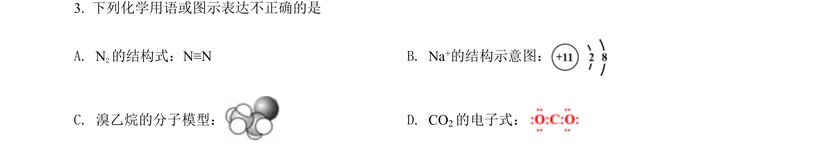
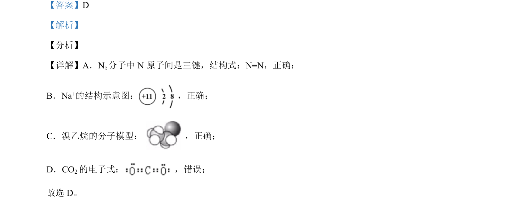

## 题面

## 摘要

考查元素周期律的应用，判断性质比较是否能用电负性周期律解释

## 关联考点

- [[252-元素周期律|元素周期律]]
- [[989-非金属性|非金属性]]
- [[酸碱性]]
- [[980-热稳定性|热稳定性]]

## 答案与解析

> 📄 原 PDF 第 2 页：`素材/真题/北京/2008-2024·（北京）化学高考真题/2021年高考化学试卷（北京）（解析卷）.pdf`

<!-- 题干文本-start -->
## 题干文本
3. 下列化学用语或图示表达不正确的是
A. N2的结构式：N≡N B. Na+的结构示意图：
C. 溴乙烷的分子模型：D. CO2的电子式：
<!-- 题干文本-end -->

<!-- 解析文本-start -->
## 解析文本
【答案】D
【解析】
【分析】
【详解】A．N2分子中 N 原子间是三键，结构式：N≡N，正确；
B．Na+的结构示意图： ，正确；
C．溴乙烷的分子模型：  ，正确；
D．CO2的电子式： ，错误；
故选 D。
<!-- 解析文本-end -->
