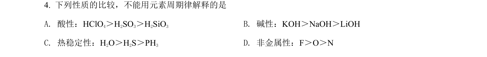
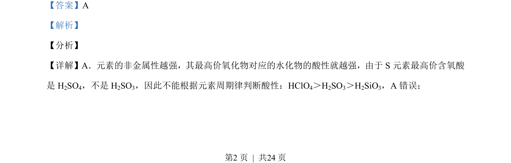
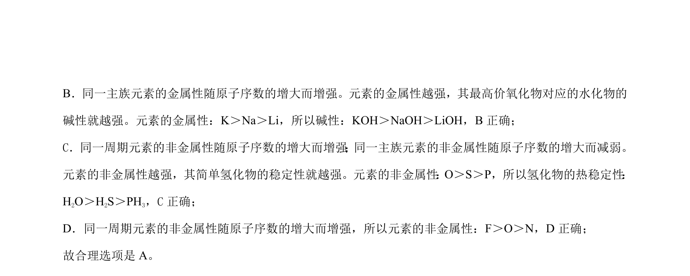

## 题面

## 摘要

本题考查元素周期律的应用，通过比较元素非金属性与金属性判断物质酸性、碱性及氢化物稳定性。

## 关联考点

- [[252-元素周期律|元素周期律]]
- [[非金属性]]
- [[金属性]]
- [[最高价氧化物水化物酸性]]
- [[氢化物稳定性]]

## 答案与解析

> 📄 原 PDF 第 2 页：`素材/真题/北京/2008-2024·（北京）化学高考真题/2021年高考化学试卷（北京）（解析卷）.pdf`
