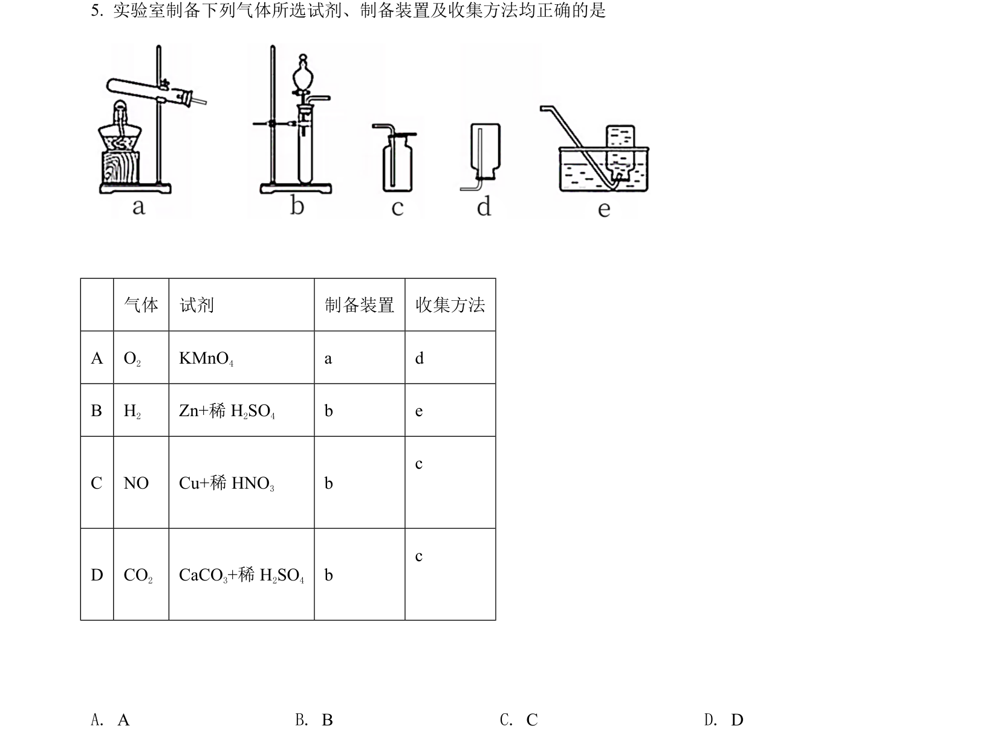
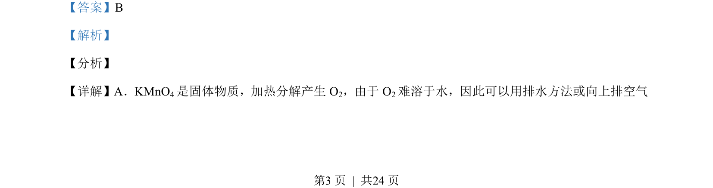
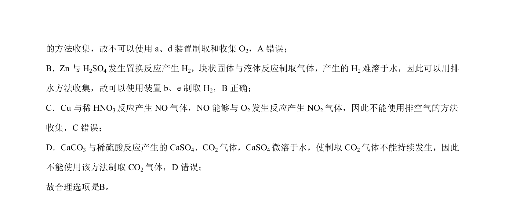

## 题面

## 摘要

考查常见气体制备与收集装置的选择及SO₂溶解性实验分析。

## 关联考点

- [[常见气体制备]]
- [[728-气体收集方法|气体收集方法]]
- [[气体溶解性]]
- [[实验装置选择]]

## 答案与解析

> 📄 原 PDF 第 3 页：`素材/真题/北京/2008-2024·（北京）化学高考真题/2021年高考化学试卷（北京）（解析卷）.pdf`
