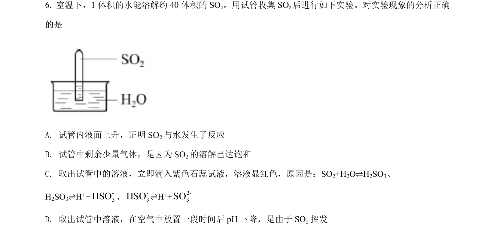
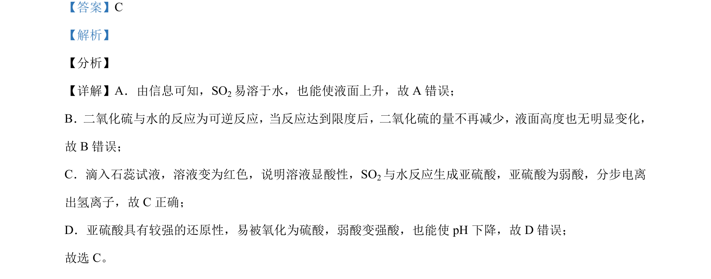

## 题面

## 摘要

考查二氧化硫的溶解性、与水反应的可逆性、水溶液的酸性及还原性，判断实验现象解释正误。

## 关联考点

- [[二氧化硫的性质]]
- [[289-可逆反应|可逆反应]]
- [[亚硫酸]]
- [[还原性]]

## 答案与解析

> 📄 原 PDF 第 4 页：`素材/真题/北京/2008-2024·（北京）化学高考真题/2021年高考化学试卷（北京）（解析卷）.pdf`
