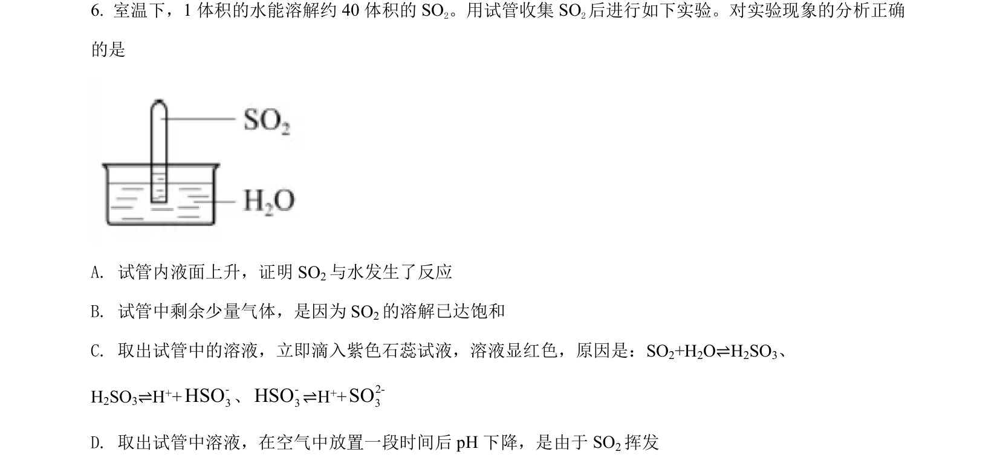
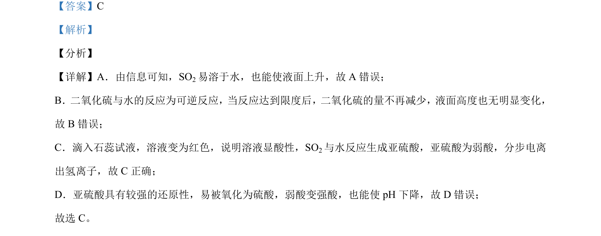

## 题面

## 摘要

考查二氧化硫的溶解性、与水反应的可逆性、水溶液的酸性及还原性，判断实验现象解释正误。

## 关联考点

- [[二氧化硫的性质]]
- [[289-可逆反应|可逆反应]]
- [[亚硫酸]]
- [[还原性]]

## 答案与解析

> 📄 原 PDF 第 4 页：`素材/真题/北京/2008-2024·（北京）化学高考真题/2021年高考化学试卷（北京）（解析卷）.pdf`

<!-- 题干文本-start -->
## 题干文本
6. 室温下，1 体积的水能溶解约 40 体积的 SO2。用试管收集 SO2后进行如下实验。对实验现象的分析正确
的是
A. 试管内液面上升，证明 SO2与水发生了反应
B. 试管中剩余少量气体，是因为 SO2的溶解已达饱和
C. 取出试管中的溶液，立即滴入紫色石蕊试液，溶液显红色，原因是：SO2+H2O⇌H2SO3、
H2SO3⇌H++-3HSO、-3HSO⇌H++2-3SO
D. 取出试管中溶液，在空气中放置一段时间后 pH 下降，是由于 SO2挥发
<!-- 题干文本-end -->

<!-- 解析文本-start -->
## 解析文本
【答案】C
【解析】
【分析】
【详解】A．由信息可知，SO2易溶于水，也能使液面上升，故 A 错误；
B．二氧化硫与水的反应为可逆反应，当反应达到限度后，二氧化硫的量不再减少，液面高度也无明显变化，
故 B错误；
C．滴入石蕊试液，溶液变为红色，说明溶液显酸性，SO2与水反应生成亚硫酸，亚硫酸为弱酸，分步电离
出氢离子，故 C正确；
D．亚硫酸具有较强的还原性，易被氧化为硫酸，弱酸变强酸，也能使 pH 下降，故 D 错误；
故选 C。
<!-- 解析文本-end -->
