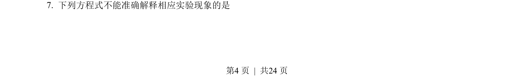
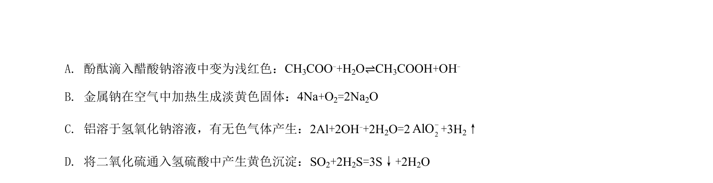
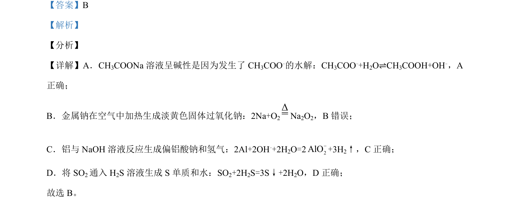

## 题面

## 摘要

通过试剂混合改变溶液离子浓度，探究导电性变化与灯光亮暗关系的实验分析

## 关联考点

- [[169-离子反应|离子反应]]
- [[979-溶液导电性|溶液导电性]]
- [[745-沉淀反应|沉淀反应]]
- [[157-弱电解质|弱电解质]]

## 答案与解析

> 📄 原 PDF 第 4 页：`素材/真题/北京/2008-2024·（北京）化学高考真题/2021年高考化学试卷（北京）（解析卷）.pdf`
