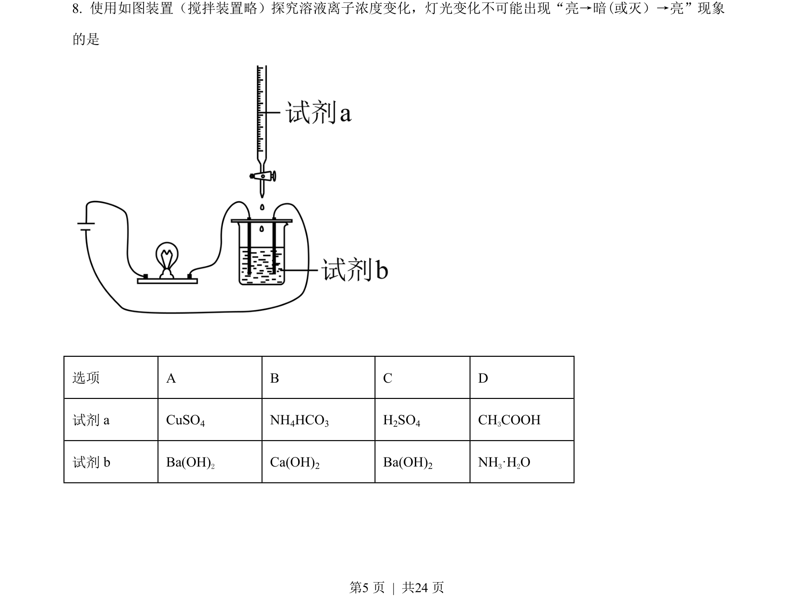
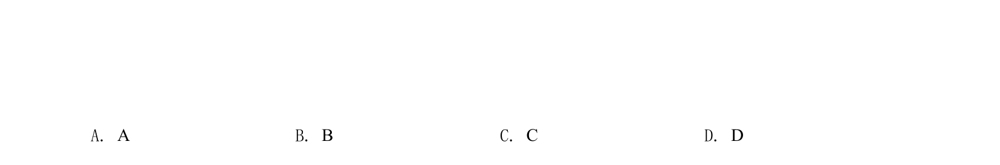
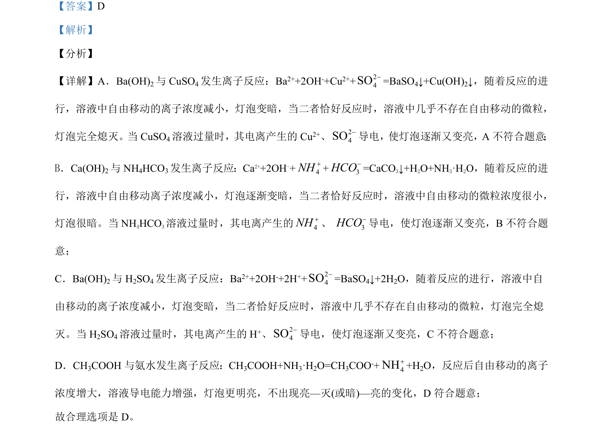

## 题面

## 摘要

考查离子反应对溶液导电性的影响，通过灯泡亮灭判断反应过程与电解质强弱。

## 关联考点

- [[169-离子反应|离子反应]]
- [[979-溶液导电性|溶液导电性]]
- [[强弱电解质]]

## 答案与解析

> 📄 原 PDF 第 5 页：`素材/真题/北京/2008-2024·（北京）化学高考真题/2021年高考化学试卷（北京）（解析卷）.pdf`
