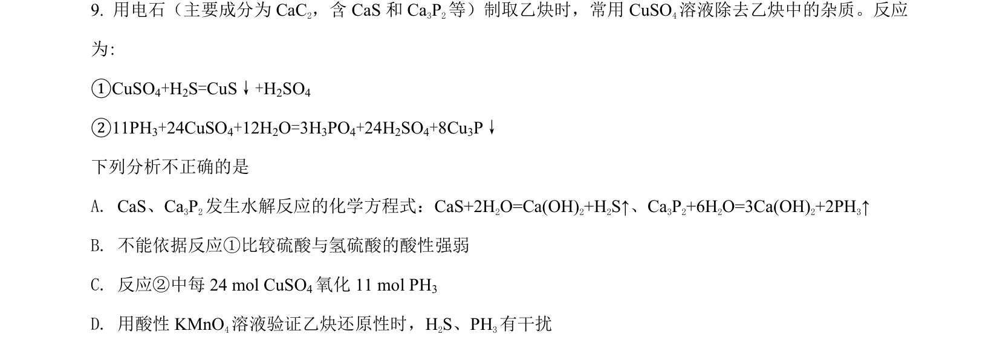
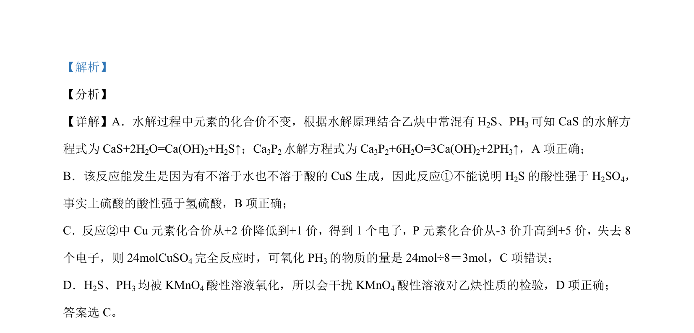

## 题面

## 摘要

该题考查杂质CaS和Ca3P2的水解、酸性比较及氧化还原反应分析。

## 关联考点

- [[742-水解反应|水解反应]]
- [[852-酸性比较|酸性比较]]
- [[162-氧化还原反应|氧化还原反应]]

## 答案与解析

> 📄 原 PDF 第 6 页：`素材/真题/北京/2008-2024·（北京）化学高考真题/2021年高考化学试卷（北京）（解析卷）.pdf`
