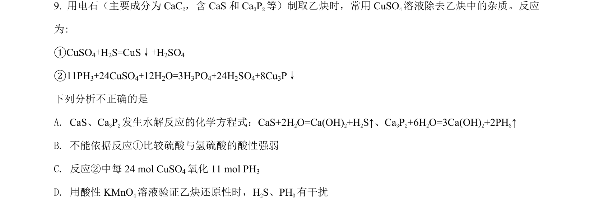
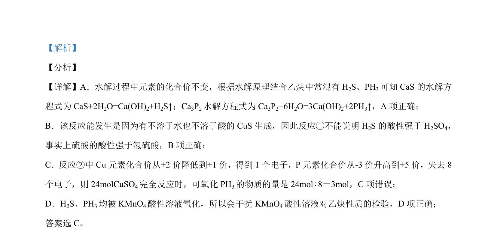

## 题面

## 摘要

该题考查杂质CaS和Ca3P2的水解、酸性比较及氧化还原反应分析。

## 关联考点

- [[742-水解反应|水解反应]]
- [[852-酸性比较|酸性比较]]
- [[162-氧化还原反应|氧化还原反应]]

## 答案与解析

> 📄 原 PDF 第 6 页：`素材/真题/北京/2008-2024·（北京）化学高考真题/2021年高考化学试卷（北京）（解析卷）.pdf`

<!-- 题干文本-start -->
## 题干文本
9. 用电石（主要成分为 CaC2，含 CaS和 Ca3P2等）制取乙炔时，常用 CuSO4溶液除去乙炔中的杂质。反应
为:
①CuSO4+H2S=CuS↓+H2SO4
②11PH3+24CuSO4+12H2O=3H3PO4+24H2SO4+8Cu3P↓
下列分析不正确的是
A. CaS、Ca3P2发生水解反应的化学方程式：CaS+2H2O=Ca(OH)2+H2S↑、Ca3P2+6H2O=3Ca(OH)2+2PH3↑
B. 不能依据反应①比较硫酸与氢硫酸的酸性强弱
C. 反应②中每 24 mol CuSO4氧化 11 mol PH3
D. 用酸性 KMnO4溶液验证乙炔还原性时，H2S、PH3有干扰
<!-- 题干文本-end -->

<!-- 解析文本-start -->
## 解析文本
【答案】C
<!-- 解析文本-end -->
