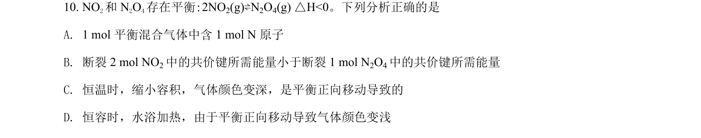
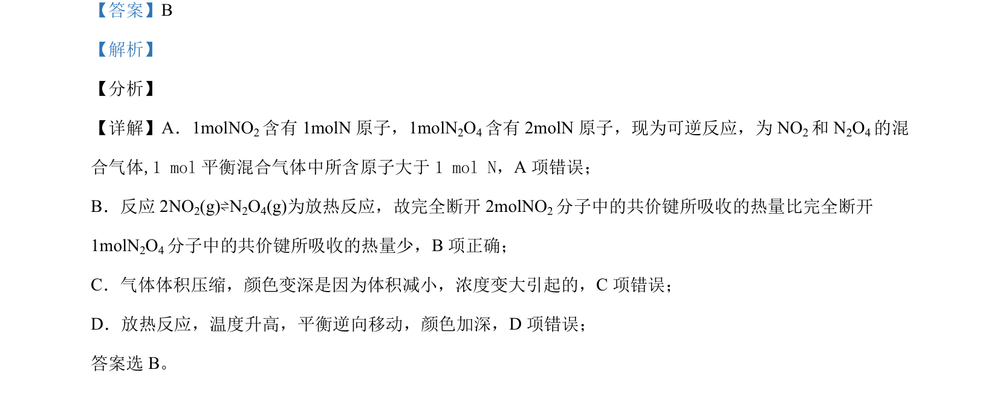

## 题面

## 摘要

考查可逆反应平衡移动、反应热判断及缩聚反应合成高分子材料的结构与性质。

## 关联考点

- [[289-可逆反应|可逆反应]]
- [[284-化学平衡|化学平衡]]
- [[288-反应热|反应热]]
- [[500-缩聚反应|缩聚反应]]
- [[448-官能团|官能团]]

## 答案与解析

> 📄 原 PDF 第 7 页：`素材/真题/北京/2008-2024·（北京）化学高考真题/2021年高考化学试卷（北京）（解析卷）.pdf`
