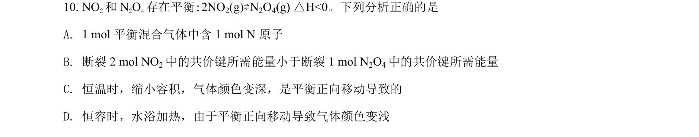
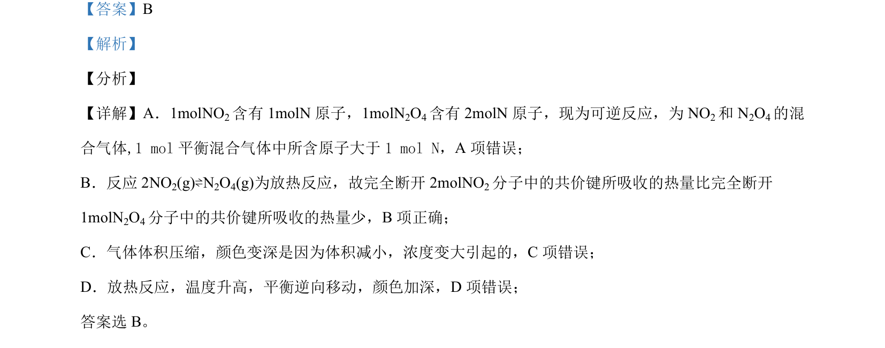

## 题面

## 摘要

考查可逆反应平衡移动、反应热判断及缩聚反应合成高分子材料的结构与性质。

## 关联考点

- [[289-可逆反应|可逆反应]]
- [[284-化学平衡|化学平衡]]
- [[288-反应热|反应热]]
- [[500-缩聚反应|缩聚反应]]
- [[448-官能团|官能团]]

## 答案与解析

> 📄 原 PDF 第 7 页：`素材/真题/北京/2008-2024·（北京）化学高考真题/2021年高考化学试卷（北京）（解析卷）.pdf`

<!-- 题干文本-start -->
## 题干文本
10. NO2和 N2O4存在平衡:2NO2(g)⇌N2O4(g) △H<0。下列分析正确的是
A. 1 mol平衡混合气体中含 1 mol N原子
B. 断裂 2 mol NO2中的共价键所需能量小于断裂 1 mol N2O4中的共价键所需能量
C. 恒温时，缩小容积，气体颜色变深，是平衡正向移动导致的
D. 恒容时，水浴加热，由于平衡正向移动导致气体颜色变浅
<!-- 题干文本-end -->

<!-- 解析文本-start -->
## 解析文本
【答案】B
【解析】
【分析】
【详解】A．1molNO2含有 1molN 原子，1molN2O4含有 2molN 原子，现为可逆反应，为 NO2和 N2O4的混
合气体,1 mol平衡混合气体中所含原子大于1 mol N， A 项错误；
B．反应 2NO2(g)⇌N2O4(g)为放热反应，故完全断开 2molNO2分子中的共价键所吸收的热量比完全断开
1molN2O4分子中的共价键所吸收的热量少，B项正确；
C．气体体积压缩，颜色变深是因为体积减小，浓度变大引起的，C项错误；
D．放热反应，温度升高，平衡逆向移动，颜色加深，D 项错误；
答案选 B。
<!-- 解析文本-end -->
