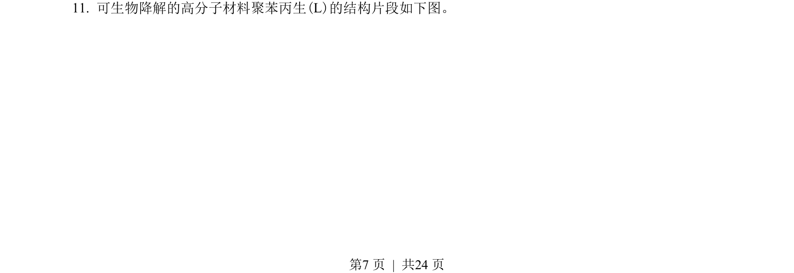
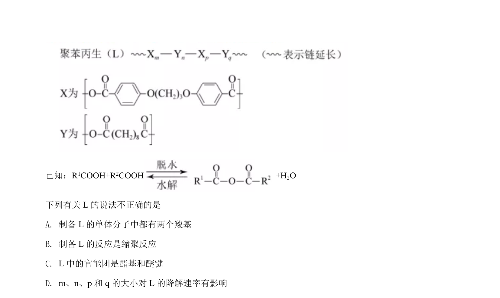
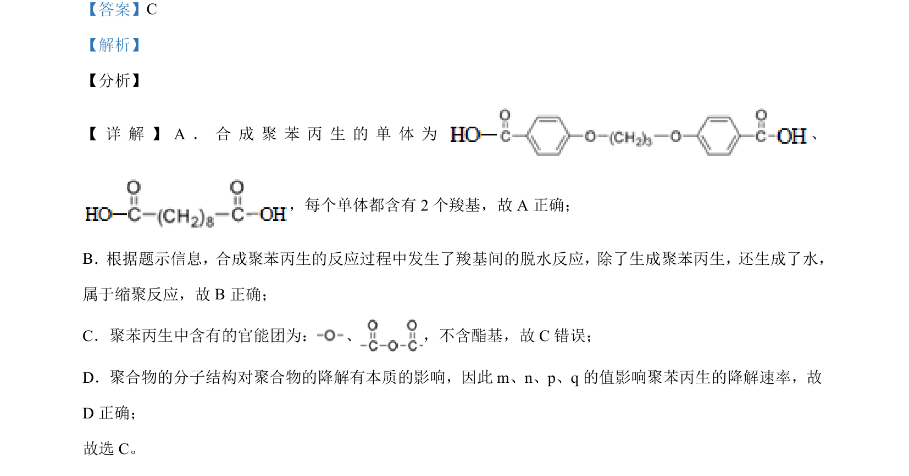

## 题面

## 摘要

聚苯丙生的单体、缩聚反应类型、官能团判断及降解速率影响因素分析

## 关联考点

- [[有机高分子单体]]
- [[500-缩聚反应|缩聚反应]]
- [[448-官能团|官能团]]
- [[聚合物降解]]

## 答案与解析

> 📄 原 PDF 第 7 页：`素材/真题/北京/2008-2024·（北京）化学高考真题/2021年高考化学试卷（北京）（解析卷）.pdf`
