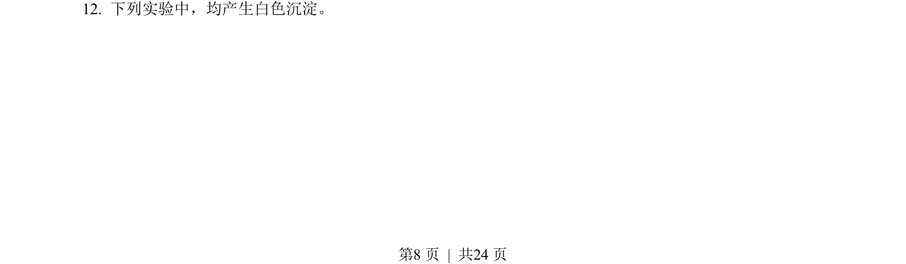
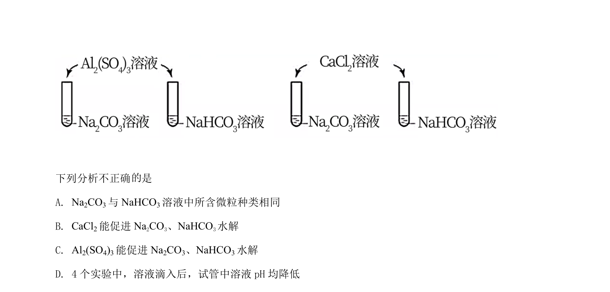
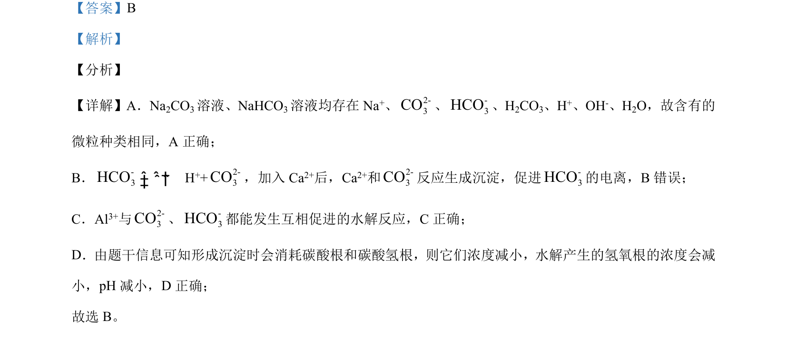

## 题面

## 摘要

本题考查碳酸钠与碳酸氢钠溶液的微粒组成、电离平衡移动及双水解反应对pH的影响。

## 关联考点

- [[334-电离平衡|电离平衡]]
- [[336-盐类水解|盐类水解]]
- [[169-离子反应|离子反应]]
- [[328-沉淀溶解平衡|沉淀溶解平衡]]

## 答案与解析

> 📄 原 PDF 第 8 页：`素材/真题/北京/2008-2024·（北京）化学高考真题/2021年高考化学试卷（北京）（解析卷）.pdf`
