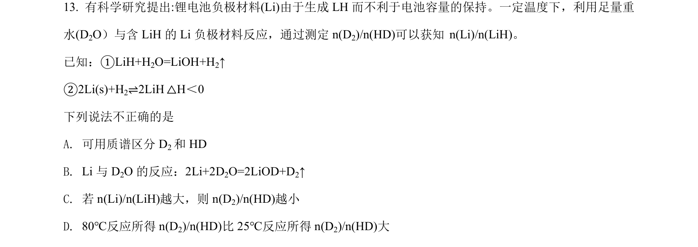
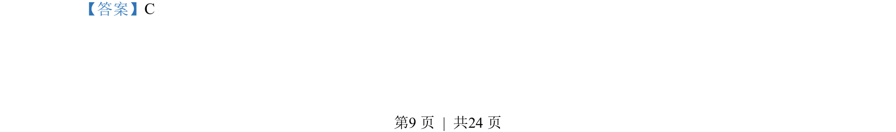
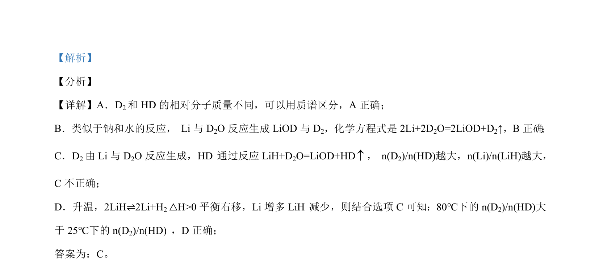

## 题面

## 摘要

考查Li与D₂O反应产物D₂、HD的生成及影响因素，涉及同位素标记、质谱分析与化学平衡移动。

## 关联考点

- [[260-同位素|同位素]]
- [[983-质谱法|质谱法]]
- [[620-化学平衡移动|化学平衡移动]]
- [[282-勒夏特列原理|勒夏特列原理]]

## 答案与解析

> 📄 原 PDF 第 9 页：`素材/真题/北京/2008-2024·（北京）化学高考真题/2021年高考化学试卷（北京）（解析卷）.pdf`
