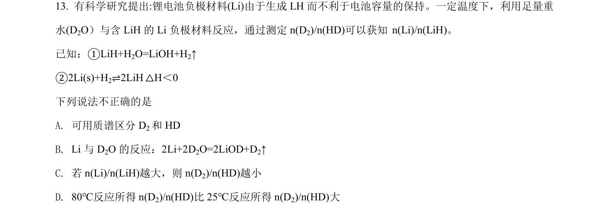
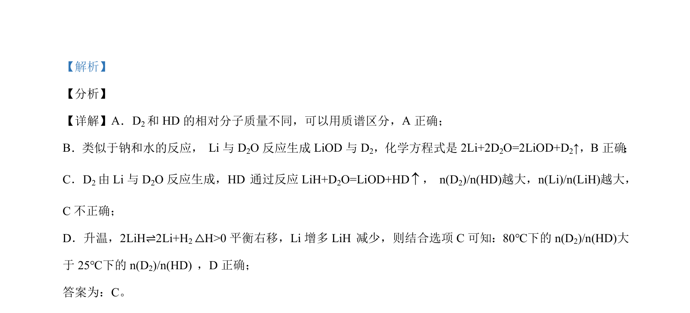

## 题面

## 摘要

考查Li与D₂O反应产物D₂、HD的生成及影响因素，涉及同位素标记、质谱分析与化学平衡移动。

## 关联考点

- [[260-同位素|同位素]]
- [[983-质谱法|质谱法]]
- [[620-化学平衡移动|化学平衡移动]]
- [[282-勒夏特列原理|勒夏特列原理]]

## 答案与解析

> 📄 原 PDF 第 9 页：`素材/真题/北京/2008-2024·（北京）化学高考真题/2021年高考化学试卷（北京）（解析卷）.pdf`

<!-- 题干文本-start -->
## 题干文本
13. 有科学研究提出:锂电池负极材料(Li)由于生成 LH 而不利于电池容量的保持。一定温度下，利用足量重
水(D2O）与含 LiH的 Li负极材料反应，通过测定 n(D2)/n(HD)可以获知 n(Li)/n(LiH)。
已知：①LiH+H2O=LiOH+H2↑
②2Li(s)+H2⇌2LiH △H＜0
下列说法不正确的是
A. 可用质谱区分 D2和 HD
B. Li与 D2O 的反应：2Li+2D2O=2LiOD+D2↑
C. 若 n(Li)/n(LiH)越大，则 n(D2)/n(HD)越小
D. 80℃反应所得 n(D2)/n(HD)比 25℃反应所得 n(D2)/n(HD)大
<!-- 题干文本-end -->

<!-- 解析文本-start -->
## 解析文本
【答案】C
的
<!-- 解析文本-end -->
