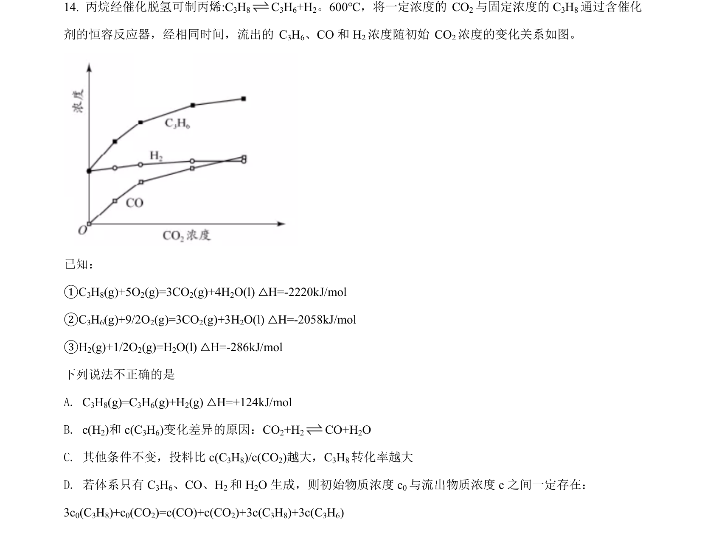
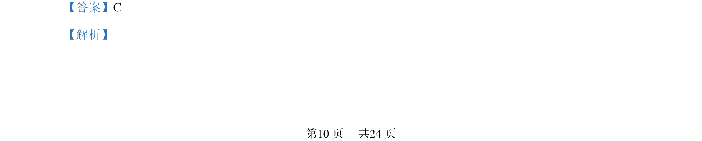
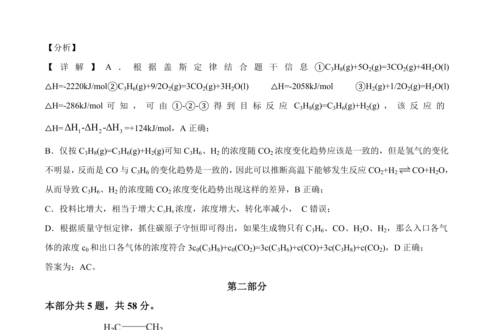

## 题面

## 摘要

考查盖斯定律计算反应焓变及化学平衡图像分析。

## 关联考点

- [[311-盖斯定律|盖斯定律]]
- [[768-热化学方程式与反应热计算|反应热计算]]
- [[528-化学平衡图像分析|化学平衡图像分析]]

## 答案与解析

> 📄 原 PDF 第 10 页：`素材/真题/北京/2008-2024·（北京）化学高考真题/2021年高考化学试卷（北京）（解析卷）.pdf`
