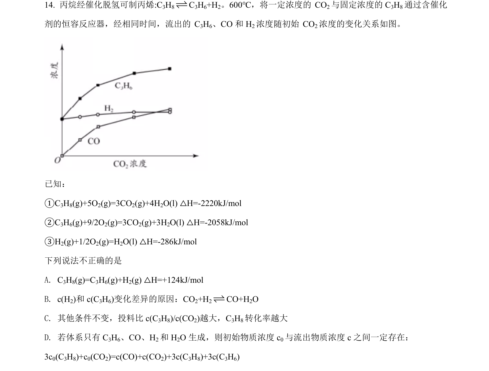
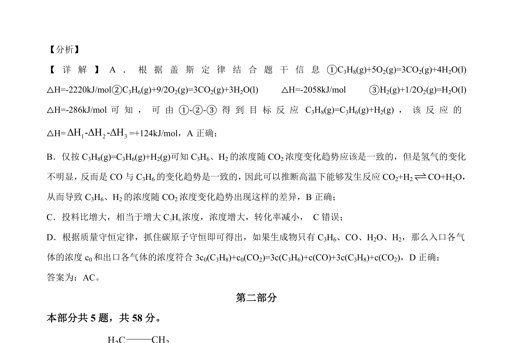

## 题面

## 摘要

考查盖斯定律计算反应焓变及化学平衡图像分析。

## 关联考点

- [[311-盖斯定律|盖斯定律]]
- [[768-热化学方程式与反应热计算|反应热计算]]
- [[528-化学平衡图像分析|化学平衡图像分析]]

## 答案与解析

> 📄 原 PDF 第 10 页：`素材/真题/北京/2008-2024·（北京）化学高考真题/2021年高考化学试卷（北京）（解析卷）.pdf`

<!-- 题干文本-start -->
## 题干文本
14. 丙烷经催化脱氢可制丙烯:C3H8C3H6+H2。600℃，将一定浓度的 CO 2与固定浓度的 C3H8通过含催化
剂的恒容反应器，经相同时间，流出的 C 3H6、CO 和 H2浓度随初始 CO 2浓度的变化关系如图。
已知：
①C3H8(g)+5O2(g)=3CO2(g)+4H2O(l) △H=-2220kJ/mol
②C3H6(g)+9/2O2(g)=3CO2(g)+3H2O(l) △H=-2058kJ/mol
③H2(g)+1/2O2(g)=H2O(l) △H=-286kJ/mol
下列说法不正确的是
A. C3H8(g)=C3H6(g)+H2(g) △H=+124kJ/mol
B. c(H2)和 c(C3H6)变化差异的原因：CO2+H2CO+H2O
C. 其他条件不变，投料比 c(C3H8)/c(CO2)越大，C3H8转化率越大
D. 若体系只有 C3H6、CO、H2和 H2O 生成，则初始物质浓度 c0与流出物质浓度 c之间一定存在：
3c0(C3H8)+c0(CO2)=c(CO)+c(CO2)+3c(C3H8)+3c(C3H6)
<!-- 题干文本-end -->

<!-- 解析文本-start -->
## 解析文本
【答案】C
【解析】
<!-- 解析文本-end -->
