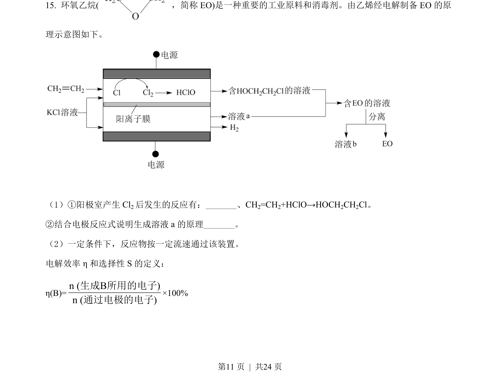
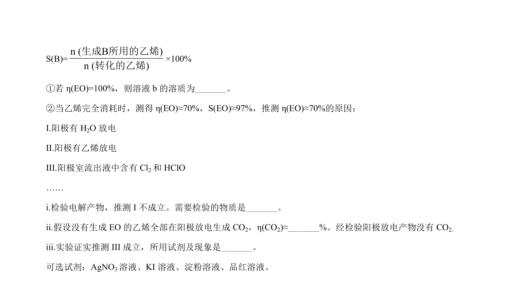
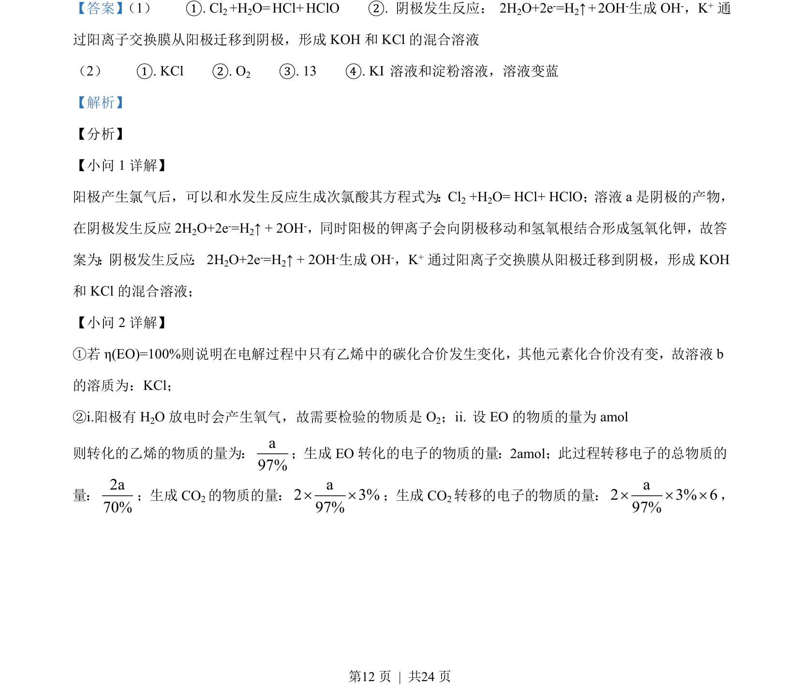
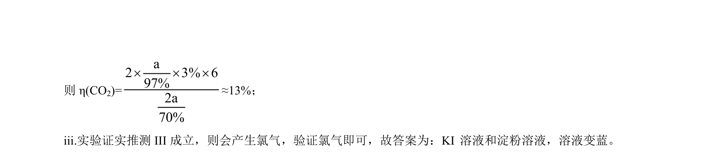

## 题面

## 摘要

考查电解池工作原理、电极反应及电子守恒计算，以及可逆反应验证与平衡常数测定。

## 关联考点

- [[368-电解池|电解池]]
- [[电子守恒计算]]
- [[342-化学平衡常数|化学平衡常数]]
- [[765-滴定分析|滴定分析]]

## 答案与解析

> 📄 原 PDF 第 11 页：`素材/真题/北京/2008-2024·（北京）化学高考真题/2021年高考化学试卷（北京）（解析卷）.pdf`
