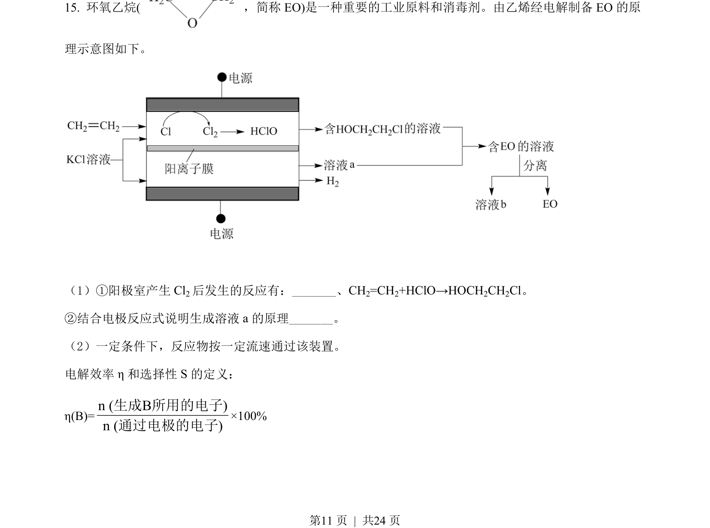
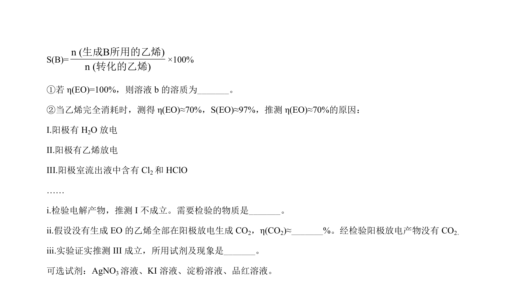
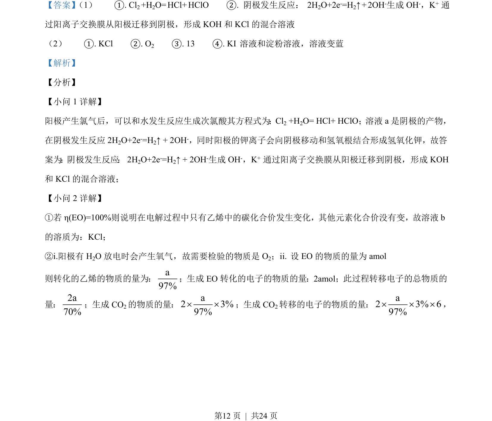
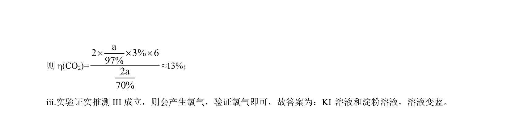

## 题面

## 摘要

考查电解池工作原理、电极反应及电子守恒计算，以及可逆反应验证与平衡常数测定。

## 关联考点

- [[368-电解池|电解池]]
- [[电子守恒计算]]
- [[342-化学平衡常数|化学平衡常数]]
- [[765-滴定分析|滴定分析]]

## 答案与解析

> 📄 原 PDF 第 11 页：`素材/真题/北京/2008-2024·（北京）化学高考真题/2021年高考化学试卷（北京）（解析卷）.pdf`

<!-- 题干文本-start -->
## 题干文本
15. 环氧乙烷( ，简称 EO)是一种重要的工业原料和消毒剂。由乙烯经电解制备 EO 的原
理示意图如下。
（1）①阳极室产生 Cl2后发生的反应有：_______、CH2=CH2+HClO→HOCH2CH2Cl。
②结合电极反应式说明生成溶液 a的原理_______。
（2）一定条件下，反应物按一定流速通过该装置。
电解效率 η和选择性 S 的定义：
η(B)=n ( B )n ( )生成所用的电子通过电极的电子
×100%
<!-- 题干文本-end -->

<!-- 解析文本-start -->
## 解析文本

<!-- 解析文本-end -->
