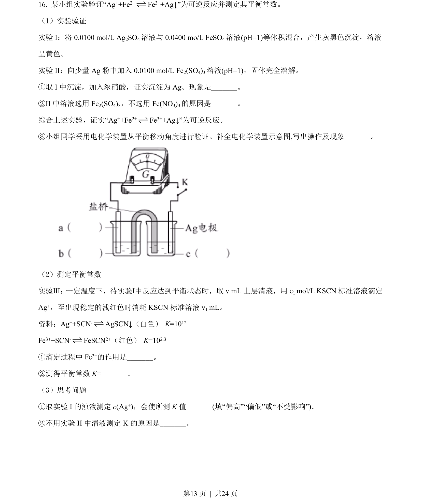
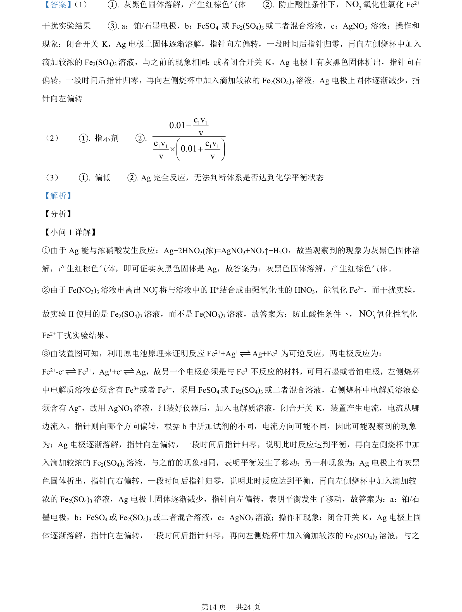
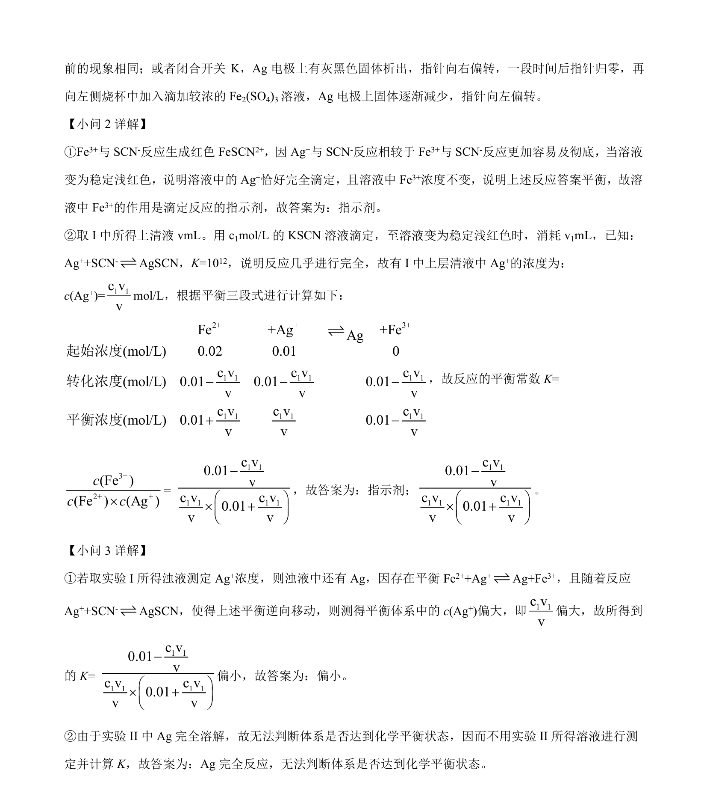

## 题面

## 摘要

考查银与浓硝酸反应、硝酸根在酸性条件下氧化Fe²⁺的干扰及利用原电池证明可逆反应。

## 关联考点

- [[银与浓硝酸反应]]
- [[硝酸根氧化性]]
- [[641-原电池原理|原电池原理]]
- [[可逆反应平衡移动]]

## 答案与解析

> 📄 原 PDF 第 13 页：`素材/真题/北京/2008-2024·（北京）化学高考真题/2021年高考化学试卷（北京）（解析卷）.pdf`
