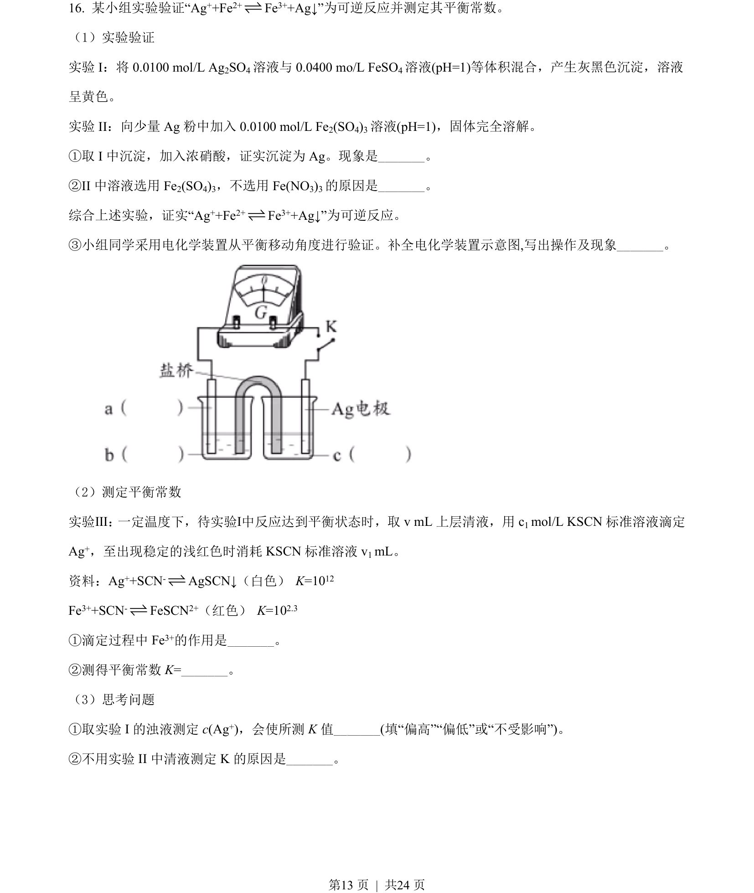
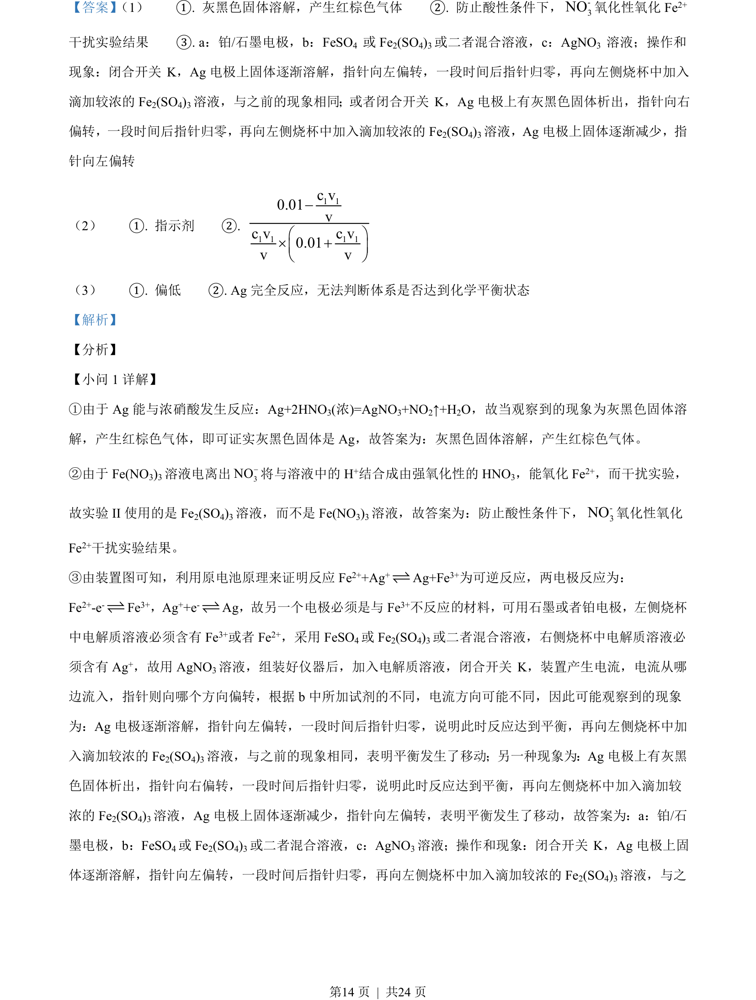
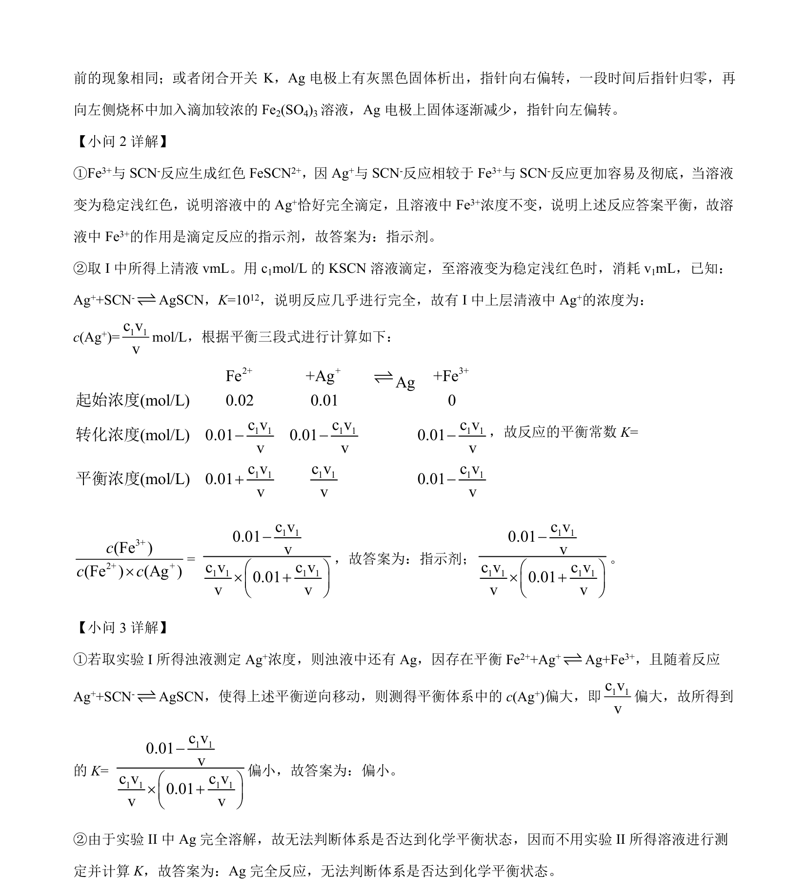

## 题面

## 摘要

考查银与浓硝酸反应、硝酸根在酸性条件下氧化Fe²⁺的干扰及利用原电池证明可逆反应。

## 关联考点

- [[银与浓硝酸反应]]
- [[硝酸根氧化性]]
- [[641-原电池原理|原电池原理]]
- [[可逆反应平衡移动]]

## 答案与解析

> 📄 原 PDF 第 13 页：`素材/真题/北京/2008-2024·（北京）化学高考真题/2021年高考化学试卷（北京）（解析卷）.pdf`

<!-- 题干文本-start -->
## 题干文本
16. 某小组实验验证“Ag++Fe2+Fe3++Ag↓”为可逆反应并测定其平衡常数。
（1）实验验证
实验 I：将 0.0100 mol/L Ag2SO4溶液与 0.0400 mo/L FeSO4溶液(pH=1)等体积混合，产生灰黑色沉淀，溶液
呈黄色。
实验 II：向少量 Ag 粉中加入 0.0100 mol/L Fe2(SO4)3溶液(pH=1)，固体完全溶解。
①取 I 中沉淀，加入浓硝酸，证实沉淀为 Ag。现象是_______。
②II 中溶液选用 Fe2(SO4)3，不选用 Fe(NO3)3的原因是_______。
综合上述实验，证实“Ag++Fe2+Fe3++Ag↓”为可逆反应。
③小组同学采用电化学装置从平衡移动角度进行验证。补全电化学装置示意图,写出操作及现象_______。
（2）测定平衡常数
实验Ⅲ： 一定温度下，待实验Ⅰ中反应达到平衡状态时，取 v mL上层清液，用 c1 mol/L KSCN标准溶液滴定
Ag+，至出现稳定的浅红色时消耗 KSCN 标准溶液 v1 mL。
资料：Ag++SCN-AgSCN↓（白色） K=10 12
Fe3++SCN-FeSCN2+（红色） K=10 2.3
①滴定过程中 Fe3+的作用是_______。
②测得平衡常数 K=_______。
（3）思考问题
①取实验 I 的浊液测定 c(Ag+)，会使所测 K值_______(填“偏高”“偏低”或“不受影响”)。
②不用实验 II中清液测定 K 的原因是_______。
<!-- 题干文本-end -->

<!-- 解析文本-start -->
## 解析文本

<!-- 解析文本-end -->
