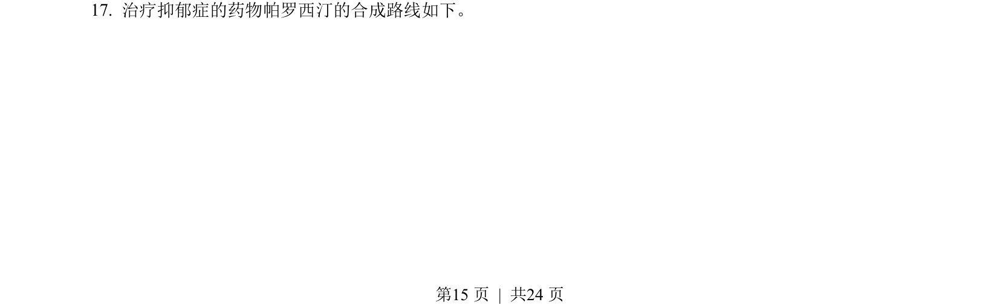
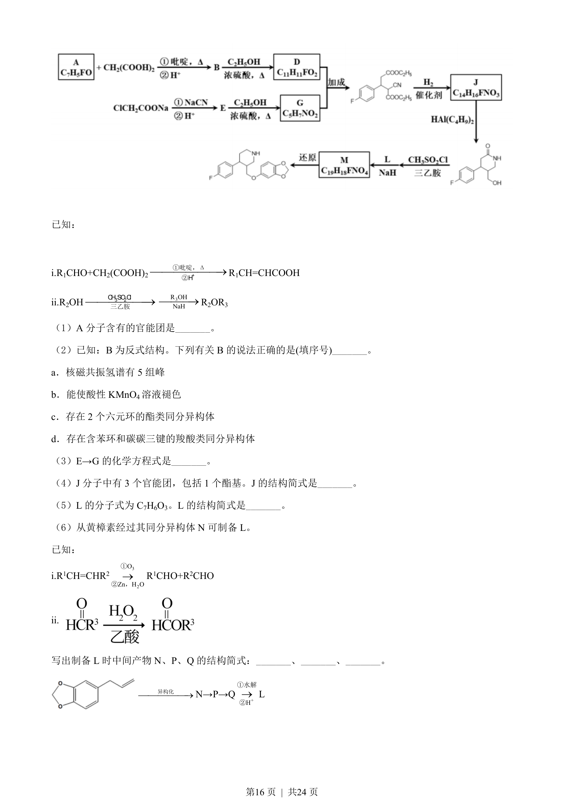
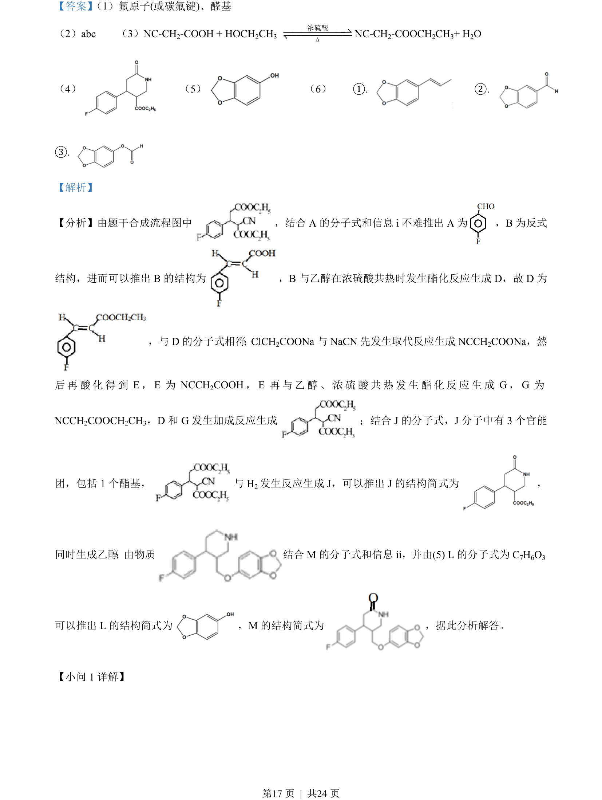
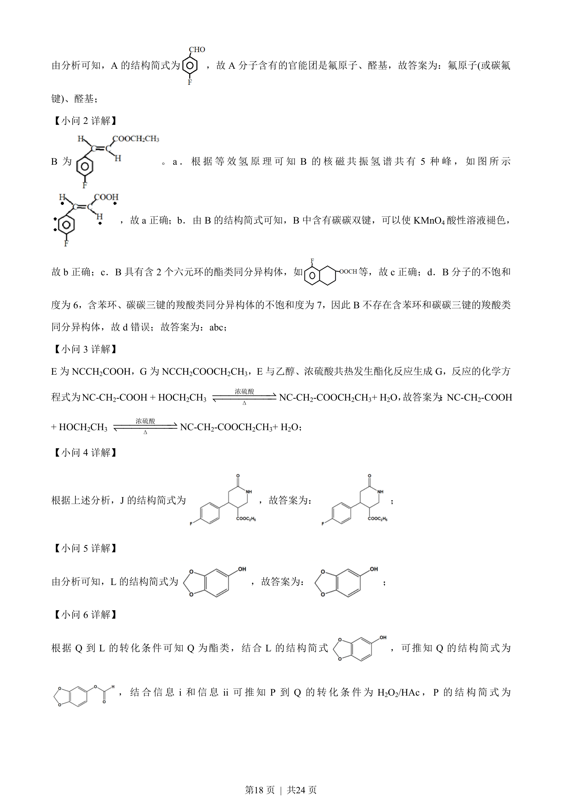
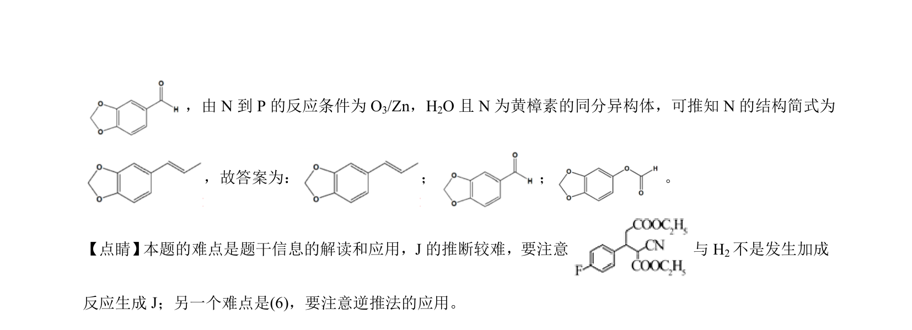

## 题面

## 摘要

本题为有机合成推断，考查官能团识别与核磁共振氢谱分析。

## 关联考点

- [[448-官能团|官能团]]
- [[723-核磁共振氢谱|核磁共振氢谱]]
- [[545-有机推断|有机推断]]

## 答案与解析

> 📄 原 PDF 第 15 页：`素材/真题/北京/2008-2024·（北京）化学高考真题/2021年高考化学试卷（北京）（解析卷）.pdf`
