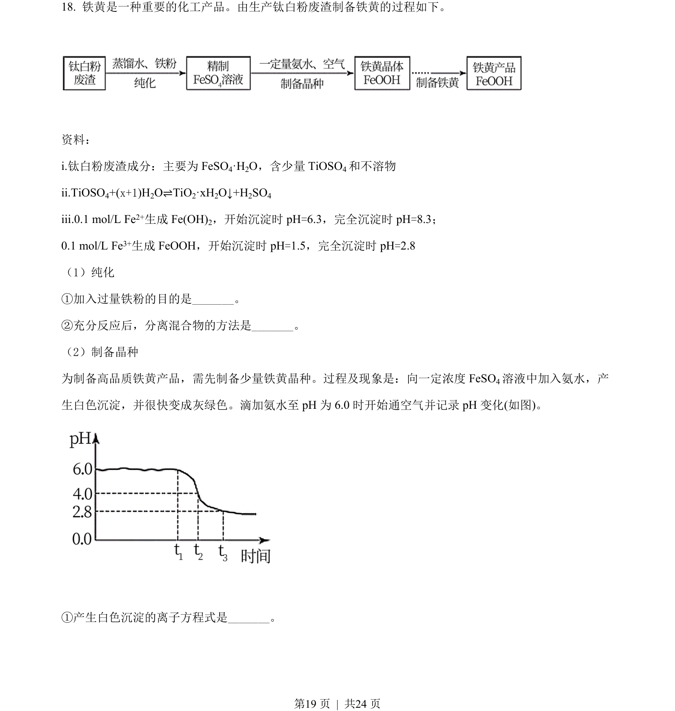
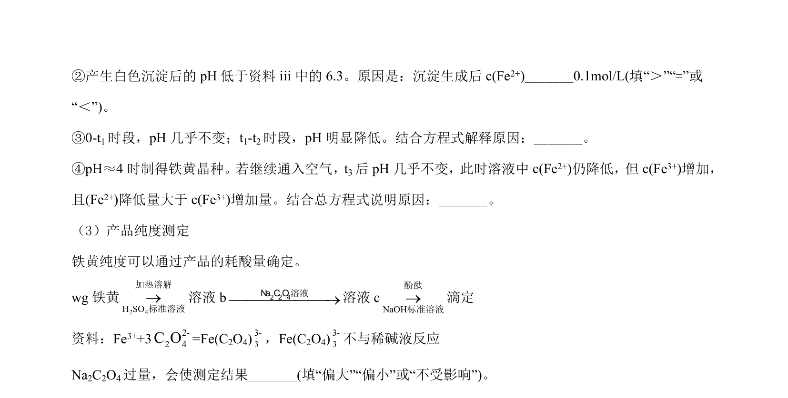
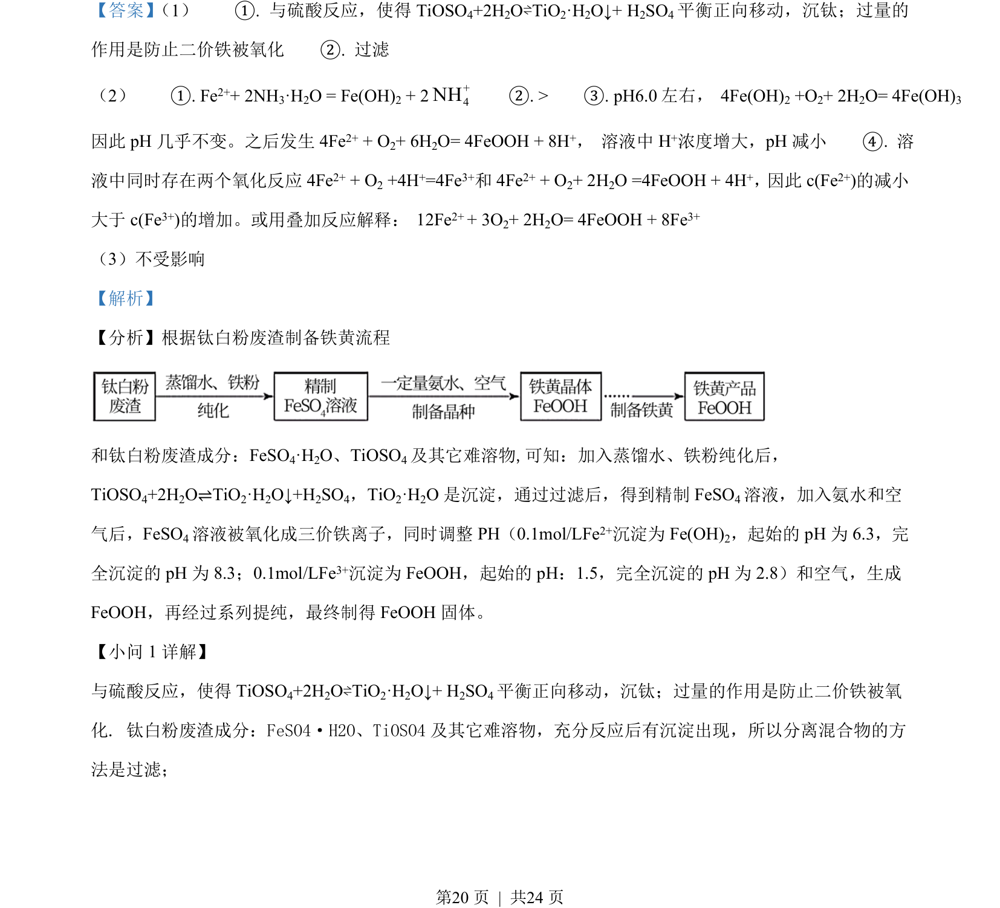
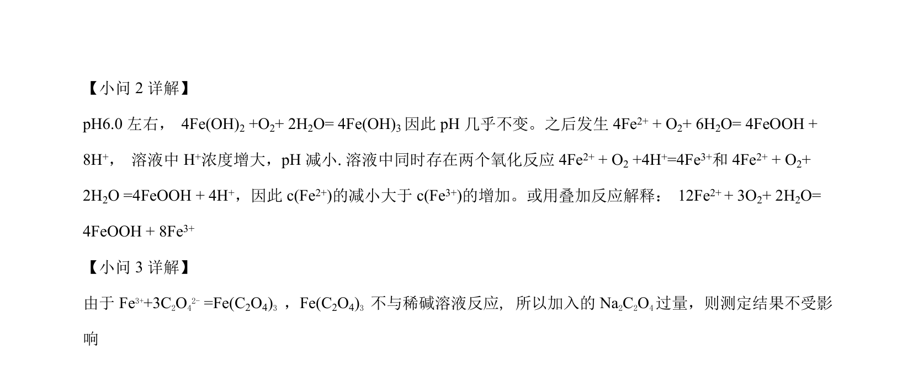

## 题面

## 摘要

以钛白粉废渣为原料制备铁黄的工艺流程分析，涉及物质分离、氧化还原反应及pH调控。

## 关联考点

- [[773-物质分离提纯|物质分离提纯]]
- [[162-氧化还原反应|氧化还原反应]]
- [[pH调控]]
- [[离子沉淀]]

## 答案与解析

> 📄 原 PDF 第 19 页：`素材/真题/北京/2008-2024·（北京）化学高考真题/2021年高考化学试卷（北京）（解析卷）.pdf`
