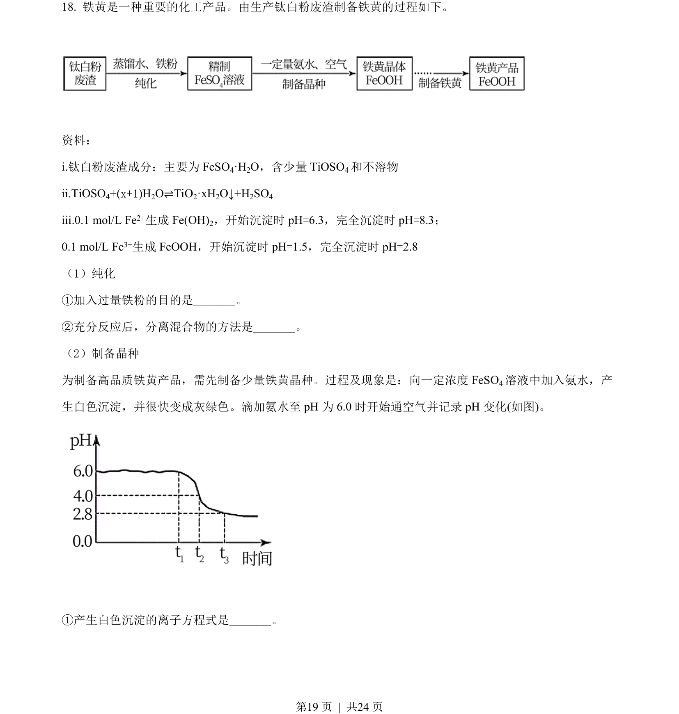
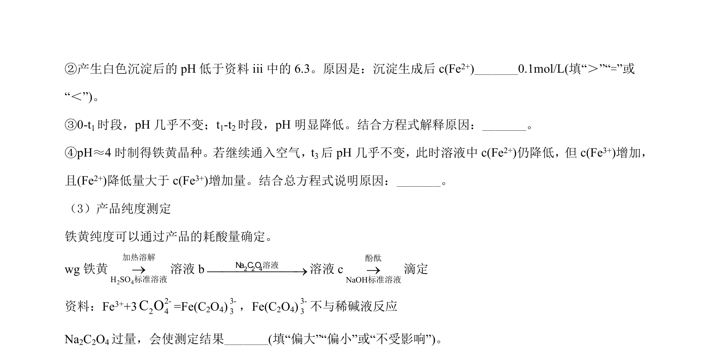
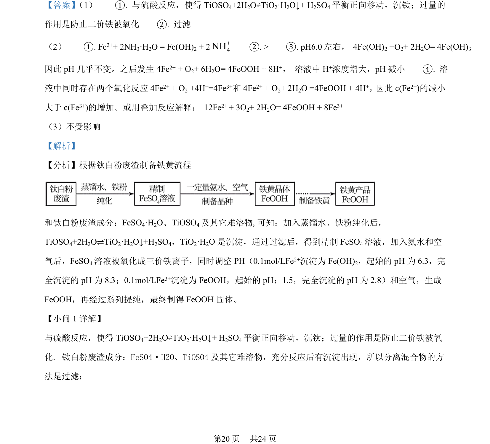
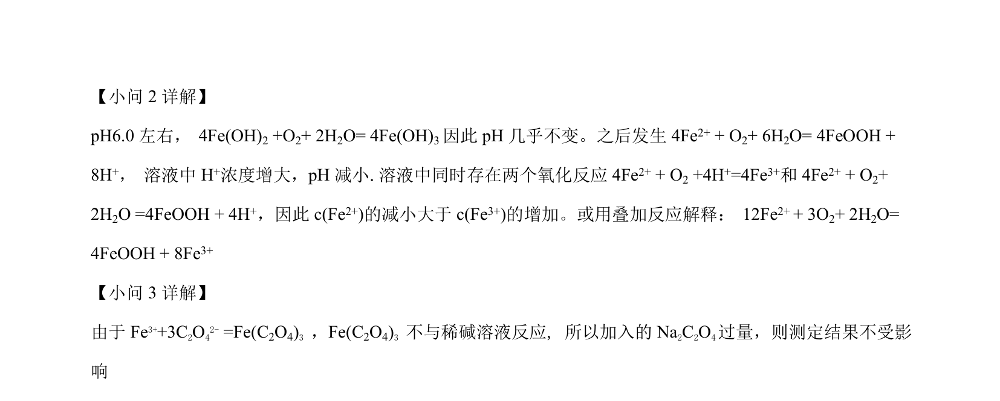

## 题面

## 摘要

以钛白粉废渣为原料制备铁黄的工艺流程分析，涉及物质分离、氧化还原反应及pH调控。

## 关联考点

- [[773-物质分离提纯|物质分离提纯]]
- [[162-氧化还原反应|氧化还原反应]]
- [[pH调控]]
- [[离子沉淀]]

## 答案与解析

> 📄 原 PDF 第 19 页：`素材/真题/北京/2008-2024·（北京）化学高考真题/2021年高考化学试卷（北京）（解析卷）.pdf`

<!-- 题干文本-start -->
## 题干文本
18. 铁黄是一种重要的化工产品。由生产钛白粉废渣制备铁黄的过程如下。
资料：
i.钛白粉废渣成分：主要为 FeSO4·H2O，含少量 TiOSO4和不溶物
ii.TiOSO4+(x+1)H2O⇌TiO2·xH2O↓+H2SO4
iii.0.1 mol/L Fe2+生成 Fe(OH)2，开始沉淀时 pH=6.3，完全沉淀时 pH=8.3；
0.1 mol/L Fe3+生成 FeOOH，开始沉淀时 pH=1.5，完全沉淀时 pH=2.8
（1）纯化
①加入过量铁粉的目的是_______。
②充分反应后，分离混合物的方法是_______。
（2）制备晶种
为制备高品质铁黄产品，需先制备少量铁黄晶种。过程及现象是：向一定浓度 FeSO4溶液中加入氨水，产
生白色沉淀，并很快变成灰绿色。滴加氨水至 pH 为 6.0 时开始通空气并记录 pH 变化(如图)。
①产生白色沉淀的离子方程式是_______。
<!-- 题干文本-end -->

<!-- 解析文本-start -->
## 解析文本

<!-- 解析文本-end -->
