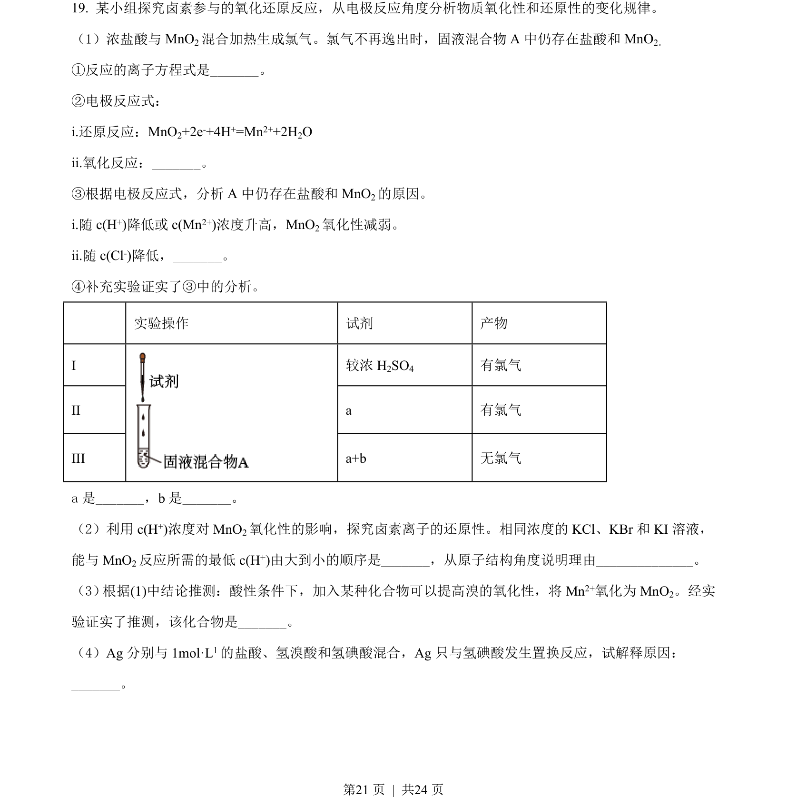
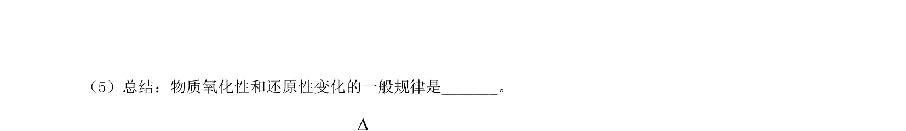
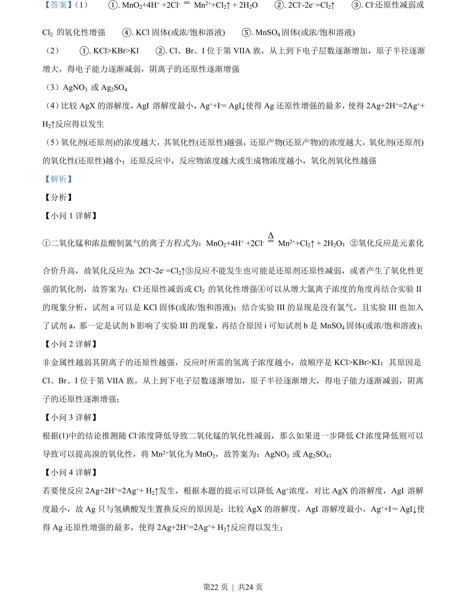
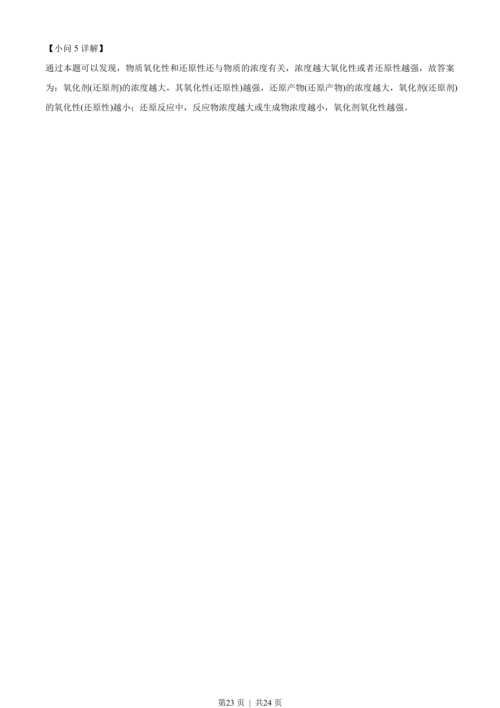

## 题面

## 摘要

本题通过探究二氧化锰与浓盐酸反应条件，考查氧化还原反应规律、卤素离子还原性比较及浓度对物质氧化性/还原性的影响。

## 关联考点

- [[162-氧化还原反应|氧化还原反应]]
- [[浓度对氧化性/还原性的影响]]
- [[卤素离子还原性比较]]
- [[482-实验设计|实验探究]]

## 答案与解析

> 📄 原 PDF 第 21 页：`素材/真题/北京/2008-2024·（北京）化学高考真题/2021年高考化学试卷（北京）（解析卷）.pdf`
