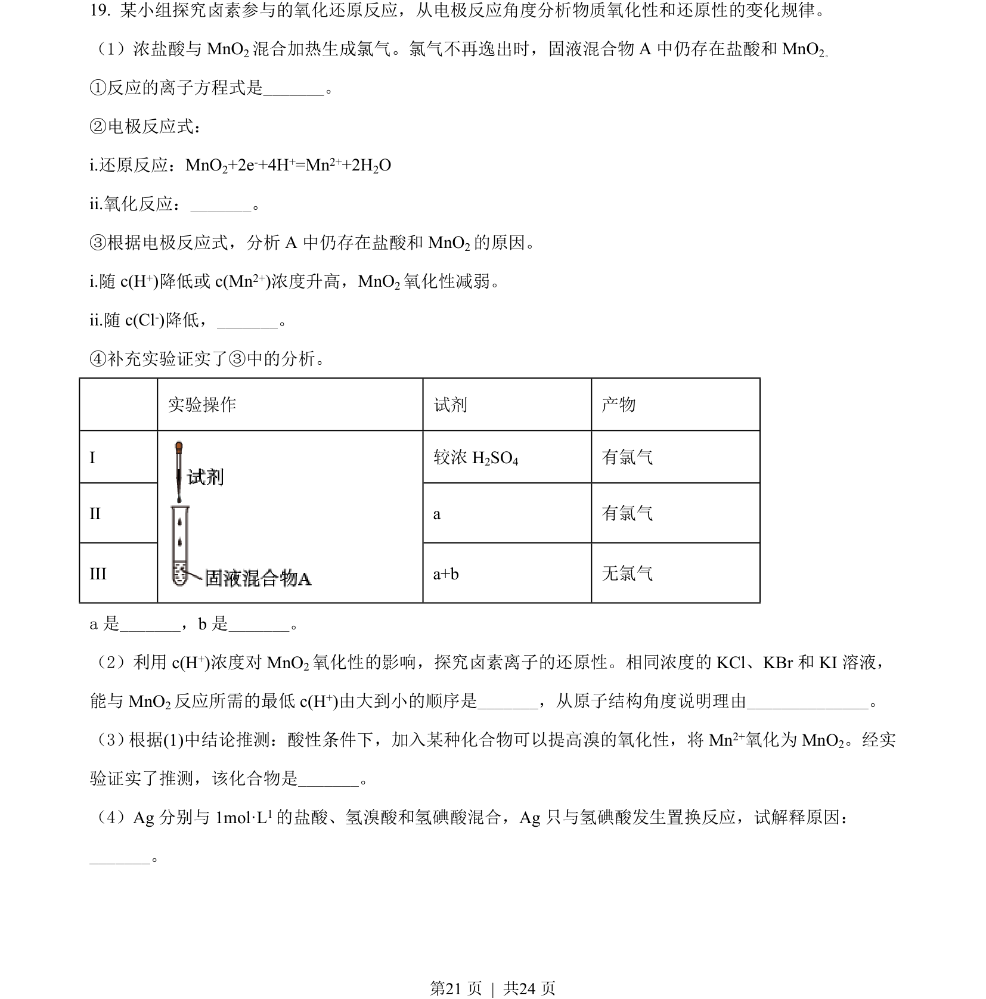
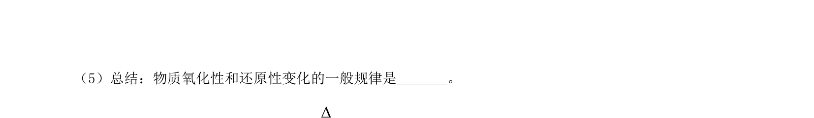
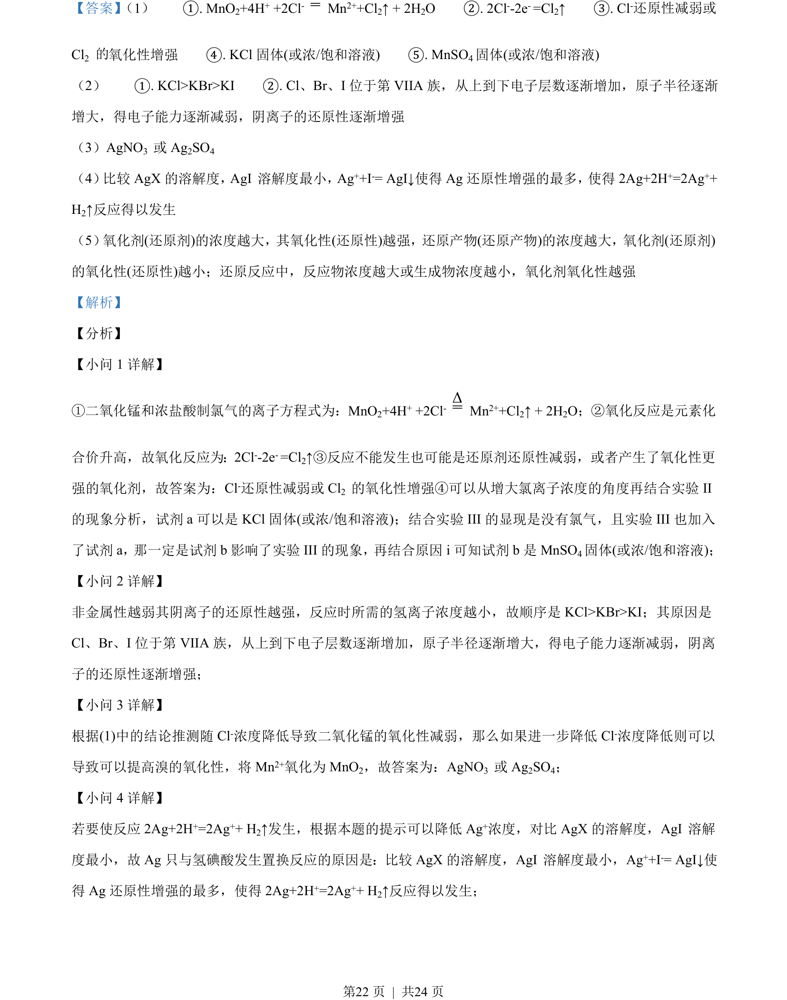
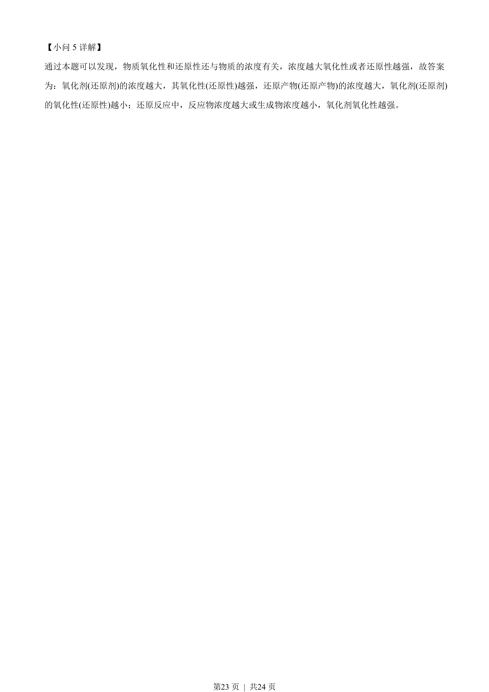

## 题面

## 摘要

本题通过探究二氧化锰与浓盐酸反应条件，考查氧化还原反应规律、卤素离子还原性比较及浓度对物质氧化性/还原性的影响。

## 关联考点

- [[162-氧化还原反应|氧化还原反应]]
- [[浓度对氧化性/还原性的影响]]
- [[卤素离子还原性比较]]
- [[482-实验设计|实验探究]]

## 答案与解析

> 📄 原 PDF 第 21 页：`素材/真题/北京/2008-2024·（北京）化学高考真题/2021年高考化学试卷（北京）（解析卷）.pdf`

<!-- 题干文本-start -->
## 题干文本
19. 某小组探究卤素参与的氧化还原反应，从电极反应角度分析物质氧化性和还原性的变化规律。
（1）浓盐酸与 MnO2混合加热生成氯气。氯气不再逸出时，固液混合物 A 中仍存在盐酸和 MnO2。
①反应的离子方程式是_______。
②电极反应式：
i.还原反应：MnO2+2e-+4H+=Mn2++2H2O
ii.氧化反应：_______。
③根据电极反应式，分析 A 中仍存在盐酸和 MnO2的原因。
i.随 c(H+)降低或 c(Mn2+)浓度升高，MnO2氧化性减弱。
ii.随 c(Cl-)降低，_______。
④补充实验证实了③中的分析。
实验操作 试剂 产物
I 较浓 H2SO4 有氯气
II a 有氯气
III
 a+b 无氯气
a是_______， b 是_______。
（2）利用 c(H+)浓度对 MnO2氧化性的影响，探究卤素离子的还原性。相同浓度的 KCl、KBr 和 KI 溶液，
能与 MnO2反应所需的最低 c(H+)由大到小的顺序是_______，从原子结构角度说明理由______________。
（3） 根据(1)中结论推测：酸性条件下，加入某种化合物可以提高溴的氧化性，将 Mn2+氧化为 MnO2。经实
验证实了推测，该化合物是_______。
（4）Ag 分别与 1mol·L1的盐酸、氢溴酸和氢碘酸混合，Ag 只与氢碘酸发生置换反应，试解释原因：
_______。
<!-- 题干文本-end -->

<!-- 解析文本-start -->
## 解析文本

<!-- 解析文本-end -->
